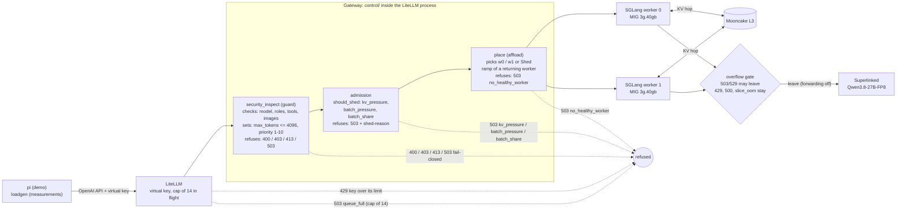
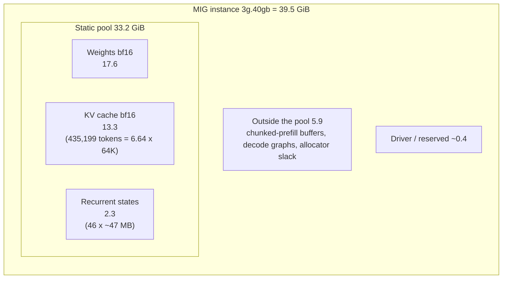
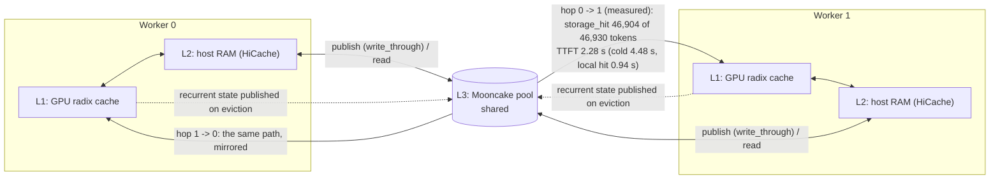

# Architecture and decisions (full reference)

This is the complete technical record: model choice, memory arithmetic, gateway layers, admission, placement, the Decision log, the roadmap, the glossary, and the answers to the course with pasted scrapes. The short, plain-language design for readers who do not need the detail is [`DESIGN.md`](DESIGN.md). Every mention of "decision N" in this file is a link to row N of the Decision log below.

# Choosing LLM

**The decision: Qwen3.5-9B, original bf16 checkpoint (`Qwen/Qwen3.5-9B`), bf16 KV cache, 64K context.** It is served by two SGLang workers on one H100 PCIe split by MIG. The comparison of every candidate with its memory numbers is in *Model selection for 1x H100*; this section gives the criteria and the quality evidence.

**Criteria** (in the order they decided the choice):
1. **It must run twice on the GPU we have.** The course needs at least two workers and we can run one H100 PCIe 80 GB (79.6 GiB): 39.5 GiB per worker. Weights must leave room for a KV pool that holds several 64K sessions.
2. **Good enough at agentic coding**, because the demo is a real coding agent (`pi`) whose answers are visible.
3. **Small KV per token** for the agent's long prompts (the prompt of an agent call is long and grows with every step): the hybrid Gated-DeltaNet layout keeps full attention in only 8 of 32 layers, so KV is 32 KiB per token in bf16.
4. **No quantization uncertainty** (decision [17](#decision-17)): bf16 weights and bf16 KV.
5. **Same family as the overflow model**, so tokenizer, chat template and tool-call format do not change when a request leaves (overflow is `Qwen3.8-27B-FP8`).

**Quality evidence** (model cards; our own coding-task numbers are not measured, and the SWE-bench figure below is a claim from a model-card discussion, not verified by us):

| Model | Evidence | Fits twice on one H100? |
| --- | --- | --- |
| Qwen3.6-27B-FP8 (first choice) | MMLU-Pro 0.888 against 0.902 for the bf16 base (98 % kept, 1.53x tokens/s; ThinkingCap-Qwen3.6-27B-FP8 card); ~90 % on SWE-bench reported in the Qwen3.6-27B discussion; ranked high at https://benchlm.ai/agentic | **No**: 2 x 26.7 GiB of weights leaves ~5 sequences of 64K in total |
| **Qwen3.5-9B (served)** | LiveCodeBench v6 **65.6**, OJBench 29.2, BFCL-V4 (tool calling) **66.1**, TAU2-Bench **79.1** (Qwen3.5-9B model card) | **Yes**: 17.6 GiB of weights, 6 sequences of 64K per worker |
| Qwen3.5-4B | LiveCodeBench v6 55.8, OJBench 24.1, BFCL-V4 50.3, TAU2-Bench 79.9 (same card) | Yes, with room to spare, but 10 points lower on coding and 16 on tool calling |

The 9B is the strongest model of the family that fits twice with a useful KV pool: the 4B loses clearly on code and tool calls (the agent's two jobs), and the 27B does not fit. What the 9B costs in quality against the 27B/35B-A3B is accepted on purpose (the grade is the serving design) and softened by the overflow destination, which is a 27B.

**Where the 27B stays.** As the **target on two H100** (one worker per GPU, 22 sequences of 64K per worker, fleet 44: computed at the end of *Max Concurrent Seqs*) and as the **overflow model** (`Qwen3.8-27B-FP8` on Superlinked).

# KV Cache per token

For every layer that keeps a KV cache (the full-attention layers; the linear-attention layers of these hybrid models keep a fixed-size state instead):

$$
KV_{\text{bytes/token}} = 2 \times N_{\text{full-attention layers}} \times N_{\text{KV heads}} \times d_{\text{head}} \times bytes_{\text{dtype}}
$$

with 2 = K and V.

| Model (KV dtype) | Full-attention layers | KV heads | d_head | Bytes | KV per token |
| --- | ---: | ---: | ---: | ---: | ---: |
| **Qwen3.5-9B, bf16 KV (served)** | 8 of 32 | 4 | 256 | 2 | 2 x 8 x 4 x 256 x 2 = **32,768 B = 32 KiB** |
| Qwen3.5-9B, fp8 KV (excluded, decision [17](#decision-17)) | 8 | 4 | 256 | 1 | 16 KiB |
| Qwen3.6-27B-FP8, fp8 KV (2-GPU target) | 16 of 64 | 4 | 256 | 1 | 2 x 16 x 4 x 256 x 1 = 32 KiB |

At 64K tokens one sequence needs 32 KiB x 65,536 = **2.0 GiB** of KV. Changing the model from the 27B to the 9B did not change bytes per token (half the full-attention layers, twice the bytes per value). The hybrid layers add a fixed recurrent state per sequence (~47 MB each) that competes with the KV for the same memory: see *Capacity on the real GPU*.

# Max Concurrent Seqs

For one worker (a MIG instance of 39.5 GiB, `--mem-fraction-static 0.85`):

```text
static pool  = 39.15 (free at start) - 0.15 x 39.5      = 33.2 GiB     (weights + KV + recurrent states)
pools        = static pool - weights = 33.2 - 17.6      = 15.6 GiB     (weights measured: 17.62 GiB)
KV           = pools / (1 + r),  r = MAMBA_FULL_MEMORY_RATIO = 0.17   = 13.3 GiB  = 435,199 tokens (measured)
max_seqs     = KV / (32 KiB x max_len)
```

| Max len | KV per request | Concurrent requests per worker | Fleet (2 workers) |
| ---: | ---: | ---: | ---: |
| 8K | 0.25 GiB | 53 | 106 |
| 16K | 0.5 GiB | 26 | 52 |
| 24K | 0.75 GiB | 17 | 34 |
| 32K | 1.0 GiB | 13 | 26 |
| **64K (served)** | 2.0 GiB | **6** | **12** |
| 128K | 4.0 GiB | 3 | 6 |

**Why 64K.** (1) *It covers what the agent sends.* Measured with real tool-using sessions (`agentgen.py`, `metrics/runs/fin2-agents`): the prompt of a call has a median of 21-24K tokens, p95 47-48K and a maximum of 55K, so 64K holds every call seen with margin, while 32K would cut the p95. (2) *It is the length the memory allows without giving up concurrency.* 6 sequences of 64K are 384K tokens, 88 % of the 435,199-token pool of a worker; 128K would leave 3 slots per worker for calls that never come close to it. (3) *A long prompt is mostly not recomputed.* The prefix cache has three layers (GPU, host RAM, and Mooncake shared by both workers, `write_through`), so while a session is active its history is read from the cache and only the new tail is prefilled (measured: 37-264 new tokens per call against 1.5-2.5K cached, `notes/findings.md`); the slots are spent mostly on decode. A longer window would add KV per slot, not throughput, so 64K is enough for this volume and this model. A prompt above 64K is refused by LiteLLM's context-window check and pi has to compact it. The cache loses a session that rests for about two minutes (27.5 % hit at the start of the next turn): that case is measured, not hidden (`notes/findings.md`, regime B).

> Units: an "80 GB" H100 exposes 79.6 GiB; every figure here is in GiB.

**Hypothesis: KV memory is the first limiter** (6 sessions of 64K per worker), then uncached prefill. **Result: refuted.** KV peaked at 62 % in every load run (83-85 % in the worst synthetic case), `kv_pressure` and the engine's retractions never fired; what limited the system was the per-call cost under load: long prefills interleave with decode and decode per sequence fell from 48.8 to 26.6 and 15.4 tok/s (`notes/findings.md`, decisions [34](#decision-34) and [36](#decision-36)).

**At the length the application actually sends (measured with `agentgen.py`, real tool-using sessions, `metrics/runs/fin2-agents`).** The prompt of one call has a median of 21-24K tokens, p95 47-48K and a maximum of 55K (the system prompt, the project instructions and the history grow as the model reads files); the output is short (median 57-68 tokens, p95 about 700). On the 435,199-token pool of a worker that is:

| Length of a call | KV of one sequence | Sequences the pool holds | Limit that binds |
| ---: | ---: | ---: | --- |
| 24K (median) | 0.75 GiB | 17 | the 6 slots (`MAX_NUM_SEQS`), not the KV |
| 48K (p95) | 1.5 GiB | 9 | the 6 slots |
| 55K (maximum seen) | 1.7 GiB | 7 | the 6 slots |
| 64K (`max_len`) | 2.0 GiB | 6 | both, by construction |

So at the lengths the agent really sends, KV is never the first limiter on this GPU: the slots are, and the sizing (6 x 64K = 384K tokens, 88 % of the pool) means running sequences cannot overcommit the KV.

**What the real agent adds.** Its calls are prefill-heavy and decode-light (21-24K prompt tokens against about 60 output tokens), so the pool to grow, if the load grew, is the prefill one (decision at "At 10x traffic").

**The 2-GPU target (not run).** With two H100 80 GB and Qwen3.6-27B-FP8 with fp8 KV: 79.6 - 26.7 (weights) - 8 (runtime) = 44.9 GiB of KV per GPU, 44.9 / 2 GiB = **22 sequences of 64K per worker, fleet 44** (this ignores the recurrent states of the hybrid layers, so it is an upper bound). Where other documents say 22 / 44 they mean this target; what runs is 6 / 12.


# Inference Architecture

What runs is on the **one H100 PCIe sliced into two MIG instances**; the 2-GPU variant is stated where it differs.

## 1. GPU

**1 x NVIDIA H100 PCIe 80 GB (79.6 GiB), MIG `3g.40gb` x 2**, one SGLang worker per instance (39.5 GiB and 46 SMs each). The reasons for this GPU and for MIG are in *GPU: why H100 PCIe 80 GB*. With two GPUs the same design runs one worker per GPU without MIG.

## 2. Model

**Qwen3.5-9B, bf16 weights (17.62 GiB measured) and bf16 KV (32 KiB per token)**, 64K context. 64K tokens of KV is 2.0 GiB per sequence; six sequences are 12 GiB, which fits the 13.3 GiB KV pool of a worker (435,199 tokens = 6.64 sequences). Alternatives and why not: *Model selection for 1x H100*.

## 3. Topology

No prefill/decode disaggregation: each worker does both. On one GPU a split would only add a hop with no extra hardware.

```text
                         Gateway (LiteLLM + control/)  -----+
                        /                 \                  |
                       /                   \                 |
        MIG instance 0 (3g.40gb)     MIG instance 1 (3g.40gb)|
            SGLang worker 0              SGLang worker 1     |
          prefill + decode             prefill + decode      |
                │                           │                |
        GPU -> host RAM (HiCache L1/L2)  GPU -> host RAM     |
                       \                   /                 |
                        \                 /                  |
                         Mooncake (L3 pool)                  |
                                                             |
                                                          overflow (503/529 only)
                                                             v
                                                    Superlinked: Qwen3.8-27B-FP8
```

The **gateway** (LiteLLM with the callbacks of `control/`) and the **engine** (SGLang) are separate boxes.

* **Gateway:** guard, admission checks, the in-flight cap (LiteLLM's own middleware), placement with the hop record, overflow gate (counting); tenants are LiteLLM virtual keys.
* **SGLang:** priority scheduling, RadixAttention, chunked prefill, KV management, prefill and decode.
* **Mooncake:** cross-worker KV through the L3 pool; the hop is proven (46,904 tokens read from L3 by the other worker, probe 5).

## 4. Concurrency

```text
max_num_seqs  = 6 per worker   (fleet 12)
max_model_len = 64K
gateway admits 12 + K = 14 (K = 2, decision 43), the next request gets a 503 at once
```

Six sequences of 64K x 32 KiB are 12 GiB of the 13.3 GiB KV pool of a worker. The two requests beyond the 12 running ones (K) wait in SGLang's priority queue, one per worker on average.

## 5. KV Transfer

**Mooncake** moves KV between workers (`write_through` publishes it when written). This is **not** prefill/decode disaggregation: each worker keeps its own prefill and decode capacity. If a useful prefix is cached on the other worker, it is read from L3 instead of recomputed (2.28 s against 4.48 s cold for a 47K prefix). Both workers share one host, so the "transfer" is GPU -> host memory -> GPU over PCIe. See *Hop*.

## 6. Overflow

The gateway owns admission control. Only a `503`/`529` may leave to **Superlinked (`Qwen3.8-27B-FP8`)**; a 429, a 500 and `slice_oom` stay (`overflow_decision` in `control/admission.py`). Forwarding is off (`OVERFLOW_ENABLED=0`): the gate counts what would leave, because the external endpoint failed (see *Overflow*).

```text
Request -> Gateway -> local capacity ok -> SGLang
                   -> 503/529 (fleet full) -> overflow gate -> leave: Superlinked | stay: answer the error
```

## 7. Scaling

No additional GPU capacity is available, so the local pool is fixed at **1 H100 as 2 workers, 6 sequences each**; extra demand is refused (503) or, once the endpoint works, sent to the overflow path. With two H100s the plan is one worker per GPU running Qwen3.6-27B-FP8 (22 sequences per worker). What to add first at 10x is in *At 10x traffic*.

# Architecture diagrams

**1. Boxes and request path, with the points where a request can die.** The gateway (LiteLLM with our callbacks) and the engine (SGLang) are two different boxes; `pi` and `script/loadgen.py` talk only to the gateway.



**2. Memory map of one worker** (MIG instance of 39.5 GiB, `--mem-fraction-static 0.85`, measured in the boot log). Numbers are GiB.



**3. Cache tiers and the hop.** Both workers run the same configuration (the manifests differ only in name, port and GPU): each one publishes its KV to Mooncake (`write_through`) and each one reads from it, so there is no writer and no reader. "src" and "dst" below are the roles of one hop, not fixed workers: the arrows are drawn for worker 0 -> worker 1 and are the same, mirrored, for worker 1 -> worker 0. A prefix is reusable on the other worker only after its KV pages **and** a recurrent-state snapshot are in L3 (KV is published at once; the snapshot when it is evicted from the 46-entry pool; probe 5).



The publishing cost is split evenly: every worker publishes the KV of what it computes, and the placement decides who computes (`affload` balances the load, so neither worker is the one that "generates the new things").

If the session stays on its worker the prefix is already in L1 and nothing moves (`orch_placement_session_total{result="kept"}`); if it moves to the other worker the placement records the hop (`orch_hops_total`, `orch_hop_tokens_total`).

# Gateway layers

The gateway is LiteLLM plus two callbacks that run inside it (`control/`). Each layer answers one question and does not repeat another's work.

```text
Client -> LiteLLM (key, in-flight cap) -> security_inspect -> admission (checks, batch share, placement) -> router -> SGLang
                                                                      failure: overflow gate; success: hop record
```

| Layer | Question it answers | Owns |
| --- | --- | --- |
| LiteLLM | Is this a valid, authenticated request I can route? | API keys, request parsing, context-window check (`enable_pre_call_checks`), executing the call on the deployment `place` chose (the alias `qwen-coding-w0/w1`; its own `least-busy` is only the fallback when `PLACEMENT_POLICY=litellm`), retries (0), Prometheus callback, error classes |
| `security_inspect` (`control/inspect.py`) | Does *our product* allow it? | allowed model alias, message roles, content parts (text and `data:` images only, with limits), tool count and size, 4096 output cap (clamped), priority class (1-10, interactive values normalised to 5), no `n` > 1. Fail-closed. |
| LiteLLM virtual keys (PostgreSQL) | Who is it and what is it entitled to? | one key per tenant or client with its own `max_parallel_requests`, tpm/rpm and spend; an over-limit key gets a 429 from LiteLLM |
| LiteLLM admission middleware | Can the fleet take one more request right now? | the cap of 14 in flight (12 running + K = 2), answered 503 `queue_full` at once; nothing waits at the gateway |
| `admission` (`control/admission.py`) | Is it worth running, and where? | `should_shed` (KV protection, batch protection, batch share), the placement call, the overflow-gate decision (counting), the shed reasons |
| `place` (`control/place.py`) | Which worker? | `affload`: session affinity unless the worker is busier by 3, batch to the least loaded, ties by engine queue depth; never a worker that does not answer (503 `no_healthy_worker` if none), ramp of a returning worker; records the hop when a session moves |

**What each module receives and what it can send.** The three are plain Python in `control/` and run in this order inside the LiteLLM process.

| Module | Receives | Passes on | Can answer instead |
| --- | --- | --- | --- |
| `security_inspect` | the raw request: model alias, messages, tools, `max_tokens`, `priority`, images | the same request normalised: `max_tokens` clamped to 4096, `priority` in 1-10 (interactive values become 5, default 5) | 400 (invalid role, tool, content part, image), 403 (model not allowed), 413 (too many tools or images), 503 (the guard itself failed: fail-closed) |
| `admission` | the normalised request, the fleet snapshot (KV usage, TTFT p50/p99, queue and running per worker, which workers answer) and the set of requests in flight | the request with `extra_body.priority` set and the model rewritten to the alias of the chosen worker | 503 with header `shed-reason`: `kv_pressure`, `batch_pressure`, `batch_share` (`timeout_queue` is off); after a failed call it also decides, and counts, whether the request would leave (overflow gate) |
| `place` | a session id (hash of the first user message), the priority class, requests in flight and engine queue depth per worker, which workers answer, the fleet TTFT p99 | the worker `w0` or `w1` (and the hop record when a session moves) | `Shed`, which `admission` turns into 503 `no_healthy_worker` |

*Naming.* The course calls the guard `inspect`; the file is `control/inspect.py`, loaded by LiteLLM as `security_inspect` because a module named `inspect` would shadow Python's standard-library `inspect`. Both names are the same code.

Rule: do not re-implement in a callback what LiteLLM already does (token counting, context window, generic rate limits, retries, routing, generic validation). LiteLLM's own admission middleware and per-deployment `max_parallel_requests` are kept only as a **safety net above the fleet capacity**, because they are blind to priority and tenant.

The engine scheduler (batching, prefill/decode interleaving, radix cache, KV allocation, priority ordering and retraction) is SGLang's. The gateway decides *whether and in what order* a request enters; it never re-implements the scheduler.

**How the control plane is plugged into LiteLLM.** There is no separate service: `control/*.py` is a ConfigMap (`litellm-security`, built by `launch_cluster.sh`; `inspect.py` is renamed `security_inspect.py`) mounted read-only at `/app/security`, and `PYTHONPATH=/app/security` lets LiteLLM import it. `config.yaml` names two callbacks, in this order: `security_inspect.security_inspect` (guard) and `admission.admission_handler` (admission). `place.py` and `fleet_state.py` are **not** callbacks but libraries that `admission.py` imports (`from security.place import PLACEMENT`); each builds one process-wide object at import time (the in-flight cap is not here: it is LiteLLM's own middleware, set in `config.yaml`). The life of a request:

```text
client --HTTP--> LiteLLM (auth, context window)
   -> security_inspect.async_pre_call_hook      reject 400/403/413/503, default priority
   -> admission.async_pre_call_hook             stateless sheds (kv_pressure, batch_pressure), tenant window (429),
        (the cap of 14 in flight was applied before, by LiteLLM's middleware: 503 queue_full at once; nothing is held at the gateway)
        optional placement: picks a worker and rewrites the model to its alias
   -> LiteLLM router (sends it to the worker `place` chose by alias) -> SGLang worker
   <- async_log_success_event (hop record) / async_log_failure_event / async_post_call_failure_hook (overflow gate)
      -> placement count released
      (a reaper task started by the first request frees slots older than 330 s; a client that leaves while waiting
       cancels the coroutine and `acquire` handles CancelledError without leaking the slot: tested)
```

The metrics are registered in the default `prometheus_client` registry, which is the one LiteLLM serves on `/metrics`; Prometheus prefixes them as `litellm_orch_*`. The shared state (`fleet_state`, `places`) deliberately lives in modules imported **under one name** (`security.*`) because `admission.py` itself is imported twice (callback `admission...` and startup hook `security.admission:...`); importing a metrics module under two names fails with `Duplicated timeseries in CollectorRegistry` (reproduced in the pod).

**Constraint: one process, one replica.** The queue is in memory. Verified in the cluster: `replicas=1` and a single `litellm` process (no `--num_workers`). Two replicas or two workers would each build their own 14 places and double the fleet capacity the workers can take (the engine would absorb it as queueing, not as rejections). Scaling the gateway out needs a shared store for slots (for example Redis) or fronting the replicas with a consistent router; until then the gateway is a single point of failure by design, which is acceptable for one GPU.

# Admission and priority

**Priority.** Lower number = more urgent. `priority <= 5` is *interactive* (default 5), `> 5` is *batch*. `admission` forwards it to SGLang (`extra_body.priority`), and the workers run `--enable-priority-scheduling --schedule-low-priority-values-first --default-priority-value 5 --retraction-policy priority`, so the engine orders its own waiting queue and retracts the least urgent first. LiteLLM does not forward `priority` by itself.

**How many requests are let in: the cap of 14 and the waiting allowance K.** Each worker can work on 6 requests at the same time, so the two together run 12. The gateway lets in those 12 plus **K = 2** that wait their turn inside the engine: 14 in total ([decision 42](#decision-42), [43](#decision-43)). The 15th request is refused at once with a 503 `queue_full` instead of waiting a long time. K = 2 was chosen by measurement ([decisions 30 to 34](#decision-30)): a longer queue made every call slower and served fewer calls per minute, while K = 2 serves as many calls as K = 0, refuses fewer, and keeps the first token 4-8 s under the 20 s target.

Technical detail. The cap is LiteLLM's own admission middleware (`max_in_flight_requests_per_worker: 14` and `max_queued_requests_per_worker: 0` in `cluster/litellm/config.yaml`; a semaphore in one LiteLLM process). It replaced a counter of our own ([decision 55](#decision-55)), which gave up two things: the `shed-reason` header on this refusal, and the batch reservation. The reservation had to come back in `admission.py` (`BATCH_ADMIT_BELOW = 10`, 503 `batch_share`), because without it interactive refusals went from 1.4 % to 16.5 % ([decision 57](#decision-57)). With all 14 places taken, a scrape of the gateway's `/metrics/` is still served (HTTP 200 in the cap probe; we had predicted it would be refused, and the measurement corrected us), so Prometheus keeps its view of the gateway during an overload.

The guarantee on waiting is K: at most K = 2 requests wait beyond the running ones. There is **no first-token cut**. One was built (LiteLLM's `stream_timeout` on interactive calls, the 408 turned into a 503 `ttft_cut`; verified live: 503 after 4.2 s with a 4 s cut) and then **removed** (decisions [59](#decision-59) and [61](#decision-61)): `stream_timeout` is the socket read timeout of the whole stream, and SGLang's `qwen3_coder` tool-call parser sends nothing while the arguments of a tool call are generated (20.6 s for a 120-line file, 68 s for a 300-line one, `metrics/probes/gap_probe.py`), so with the cut pi could not write files. The final tests F1-F5 and V1-V5 ran with the cut at 20 s; it fired once in the whole N = 24 run, so their numbers stand.

| Class | Deadline (the router timeout of 300 s is only the ceiling) |
| --- | --- |
| interactive | 20 s |
| batch | 120 s |

**Shed reasons** (header `source: admission`, `Retry-After`):

| Reason | Status | Trigger | Protects |
| --- | --- | --- | --- |
| `queue_full` | 503 | 14 requests are in flight (LiteLLM's middleware; counted in `litellm_admission_rejected_requests_total`) | the engine's good regime |
| `kv_pressure` | 503 | fleet KV >= 95% and the shared prefix (system prompt + tools) was not admitted recently | KV memory; cached prefixes cost no new KV |
| `batch_pressure` | 503 | fleet TTFT p99 > 4 x p50 **and above 10 s** (half of the SLO) over the last 60 s (at least 20 samples), and the request is batch | interactive tail latency |
| `batch_share` | 503 | batch already holds fewer than `BATCH_ADMIT_BELOW` = 10 requests of ANY class in flight | the last places of the cap (4 of 14), kept for interactive calls |
| `timeout_queue` | 503 | estimate rule (waiting x TTFT p50) or the wait for a place; **off by default**: it reads gauges that are stale by seconds | work that would time out anyway |
| a virtual key over its limit | **429** | `max_parallel_requests` / tpm / rpm of that key (LiteLLM, PostgreSQL) | one caller owning the GPU |

`no_healthy_worker` (503) is answered by placement when no worker answers its metrics (decision [60](#decision-60)). `stale_telemetry` is a deliberate non-shed (decision [62](#decision-62)): a stale snapshot is reported by the alert and the age panel, never enforced as a refusal.

**Inputs.** A background poller scrapes each worker every 15 s into one FleetSnapshot (`control/fleet_state.py`). Decisions never query Prometheus per request. TTFT quantiles use a 60 s window of the cumulative histogram: lifetime quantiles stay dominated by cold requests after a restart.

**Prefix tracking.** The gateway cannot ask the engine whether a prefix is cached, so it remembers the hash of (system prompt, tools) for 30 min (LRU, fleet-wide because workers share KV through Mooncake). It is an approximation: an evicted prefix is still treated as cached.

# Status codes

What each code means and who emits it.

| Code | Meaning | Emitted by | Overflow |
| --- | --- | --- | --- |
| 400 | invalid request (role, tool, unsupported content part, remote image URL, image type, max_tokens) | `security_inspect`, LiteLLM | no |
| 401 | authentication failed | LiteLLM | no |
| 403 | model not allowed | `security_inspect` | no |
| 404 | unknown model/route | LiteLLM | no |
| 408 | timeout of an upstream call | LiteLLM | no |
| 413 | too many tools / schema too large / too many or too large images | `security_inspect` | no |
| 422 | unprocessable body | LiteLLM | no |
| 429 | rate limit of the caller's key (or LiteLLM's parallel-request safety net): caller must back off | LiteLLM | **never** |
| 500 | engine error / OOM (also an external 500 from the overflow endpoint) | LiteLLM (APIError) | no |
| 503 | capacity: shed by `admission`, LiteLLM safety net, or guard fail-closed | `admission`, LiteLLM, `security_inspect` | **may** (503/529 only) |

# Observability

Every decision leaves a metric. Gateway and control-plane metrics are exposed on LiteLLM's `/metrics` (`orch_*`, defined in `control/fleet_state.py` and `control/place.py`); engine metrics come from each worker (`sglang:*`, `worker` label); the KV store from Mooncake. Prometheus prefixes LiteLLM's as `litellm_*` and Mooncake's as `mooncake_*`.

| Metric | Answers |
| --- | --- |
| `orch_requests_admitted_total`, `orch_requests_shed_total{reason,priority_class}` | what was let in and what was refused, and why |
| `orch_gateway_in_flight`, `orch_gateway_capacity` | places in use and the limit (12 + K, batch limit); the metric names predate the rename to `places` |
| `orch_request_latency_seconds`, `orch_request_ttft_seconds` by `priority_class` | does priority protect interactive (p99 spread) |
| `orch_replica_queue_depth`, `orch_replica_running_requests`, `orch_replica_kv_used_ratio` | the snapshot the policy decides on |
| `orch_fleet_ttft_seconds`, `orch_fleet_estimated_queue_wait_seconds`, `orch_fleet_snapshot_age_seconds` | the derived inputs and how fresh they are |
| LiteLLM's `litellm_proxy_total_requests_metric_total{api_key_alias,status_code}` | who uses the GPU and who hit a limit (429), per virtual key |
| `orch_placement_total`, `orch_placement_session_total{result}`, `orch_placement_inflight` | where requests went and whether sessions stayed on their worker |
| `orch_hops_total`, `orch_hop_tokens_total` (estimated), `orch_placement_session_total{result}` | calls placed on another worker than their session's previous one (src != dst), and those that stayed |
| `orch_overflow_decisions_total{decision,status,forwarded}` | stay or leave after each failed call |
| `sglang:evicted_tokens_total`, `sglang:hicache_dropped_tokens_total{reason}`, `sglang:hicache_backup_tokens_total`, `sglang:backuped_tokens_total{storage_backend}` | eviction and publication to the lower tiers (engine's own counters) |

The Grafana dashboards (`monitoring/build_dashboards.py` generates them) describe every panel with a definition and the reason it matters.


# The application

**Track B: a tool-using coding agent.** The user works in **pi** (pi coding agent) pointed at LiteLLM as an OpenAI-compatible provider. A user turn starts a loop: think -> tool (read/edit/bash/grep) -> observe -> answer. Pi talks only to the gateway, never to SGLang.

| Part of the prompt | Shared or unique | Size (design estimate, to be measured) | Cache behaviour |
| --- | --- | --- | --- |
| system prompt + tool schemas | **shared** by every session of every tenant | 8-10K tokens | radix hit after the first request; this is the hash `admission` tracks for `kv_pressure` |
| repository context pi reads (files, grep results) | unique per session, repeated across the steps of one session | grows 1-4K per step | hit on the previous step's prefix, miss on the new tail |
| conversation history | unique, append-only | grows every step | same as above |
| new tokens of the step (observation) | unique | 0.5-4K prefill, 200-800 decode | always computed |

Shape: **multi-step decode with a lengthening prefill**. Almost all of a step's prompt was already prefilled by the previous step, so the cost that matters is the **uncached tail**, not the prompt length. That is why prefix-aware placement (below) is the lever that matters most for this app.

**Interactive** = a human waiting on pi (`priority <= 5`). **Batch** = a background sweep: an eval or a crew of agents running the same loop without a human (`priority > 5`).

**Three traffic sources, on purpose.**
- **`pi` (the real client)** shows the full path working: `app/demo/demo.sh` has pi build a todo-list web app (`app/todo-app/`) through the cluster with its own virtual key. One pi session is too small and too uncontrolled to be SLO evidence.
- **`script/loadgen.py` (synthetic)** reproduces the *shape* of an agent session (shared system prefix, history that grows per call, tool pauses, calls per turn and output lengths from the paper, interactive and batch) with random code-like text, no `tools` and forced output lengths, so a run is repeatable and controllable and the knee, the K sweep, the routing comparison, the batch run, the regime B and the soak were measured with it. It reproduces the load, not the behaviour.
- **`script/agentgen.py` (real agents)** runs sessions where the model really calls tools (`read_file`, `list_dir`, `grep` on this repository), the history is what happened and the outputs are natural (decision [56](#decision-56)). It is how the system is checked with traffic that is agentic in content, tool-call parser included.
Shared vs unique tokens, as measured: the system prompt and the tool schemas (and, for `agentgen`, the project instructions) are shared by every session; the history and the tool results are unique per session. Every plot in `plots/` and every table names the generator that produced it.

# Model selection for 1x H100

Constraint: two workers on one 80 GB GPU. Per worker: **39.5 GiB** (MIG `3g.40gb` instance; `--mem-fraction-static 0.85` leaves ~5.9 GiB for activations).

| Candidate | Weights | KV bytes/token | Verdict |
| --- | --- | --- | --- |
| Qwen3.6-27B-FP8 | 28.7 GB FP8 | 2x16x4x256x1 = 32 KiB with fp8 KV (16 of 64 layers are full attention) | does not fit twice on one GPU (57 GB of weights). Kept as the 2-GPU target. |
| Qwen3.6-35B-A3B-FP8 | ~35 GB FP8 | 2x10x2x256x1 = 10 KiB (10 of 40 layers are full attention) | best quality per active parameter, but 35 GB per worker leaves ~3 GiB per worker for KV and runtime. Fits **one** worker only. Natural model for 1 GPU each if we get 2 GPUs. |
| **Qwen3.5-9B, original bf16 checkpoint (`Qwen/Qwen3.5-9B`)** | 19.3 GB (~18 GiB) | 2x8x4x256x2 = **32 KiB** with bf16 KV (8 of 32 layers are full attention) | **chosen**: fits twice with real KV; same family, tokenizer and chat template as the 27B target, so prompts, tool-call format and the cache hash do not change when we scale up. No quantization anywhere. |
| Qwen3.5-9B quantized (`RedHatAI/Qwen3.5-9B-FP8-dynamic`, `surogate/Qwen3.5-9B-FP8`, `Hyper-AI/Qwen3.5-9B-fp8`) | 12.7 GiB (measured, RedHat) / ~11.5 (estimated, others) | same architecture; 16 KiB with fp8 KV | considered and **not used** in this run (see the trade-off table below). |
| Qwen3-8B-FP8 (pure attention) | ~8.2 GiB | 2x36x8x128x1 = 72 KiB (fp8 KV) | fallback if HiCache/Mooncake does not work with the hybrid model (see risks); 2.25x more KV per token than the chosen model's bf16 KV. |

**Why Qwen3.5-9B.** (1) Agentic coding is the use case and it is the strongest dense model in the family that fits twice; (2) the hybrid layout (3 Gated-DeltaNet linear layers per full-attention layer) keeps KV per token small, so 64K context stays possible; (3) the 27B stays the documented target, so the sizing method is the same and only the inputs change.

**Why bf16, with bf16 KV (decided).** The demonstration is a coding agent (pi) whose output quality is visible, so we prefer no quantization uncertainty over capacity. Two facts back this: the RedHat/Surogate/Hyper-AI checkpoints are third-party quantizations with no measurement of ours on code, and SGLang logs `Using FP8 KV cache but no scaling factors provided. Defaulting to scaling factors of 1.0` (observed on our own boot), i.e. the FP8 KV would run uncalibrated, with the error growing with context, which is exactly where this workload lives (~64K). The cost, computed below, is capacity and prefill speed:

| Weights | KV dtype | Weights (GiB) | KV pool (GiB) | Seqs at 64K per worker | Fleet |
| --- | --- | ---: | ---: | ---: | ---: |
| **bf16 (chosen)** | **bf16 (chosen)** | 17.6 (measured) | 13.3 | **6** | **12** |
| bf16 | fp8 | 17.6 | 13.3 | 13 | 26 |
| RedHat FP8 | bf16 | 12.7 (measured) | 17.5 | 8 | 16 |
| RedHat FP8 | fp8 | 12.7 | 17.5 | 17 | 34 |
| Surogate block-FP8 (est.) | fp8 | ~11.5 | ~18.5 | 18 | 36 |

(KV pool = (33.2 GiB static - weights) / (1 + 0.17), where 0.17 is `--mamba-full-memory-ratio`, see Capacity. Weights are the `mem usage` of the SGLang boot log: 17.62 GiB for the chosen model, 12.68 GiB for RedHat measured earlier; the surogate figure is estimated.)

Speed cost, stated plainly. FP8 tensor cores do about twice the operations per cycle of bf16, and the paper's workload is input-heavy (input:output > 275:1), so prefill dominates: the first call of a turn re-prefills ~35K tokens (cache hit ~45%), about **4 s in bf16 versus ~2 s in FP8** on a 3g slice (estimate: 0.63 PFLOP at ~150 TFLOPS effective). Decode reads all 18 GiB of weights each step at ~1 TB/s per instance, ~19 ms per step (~50 tokens/s per sequence); with a median output of 247 tokens that is ~5 s per call. Both are estimates until measured.

**What switching the model did to bytes/token** (required by the course): 27B-FP8 with fp8 KV is 32 KiB/token; the chosen 9B with bf16 KV is also **32 KiB/token** (half the full-attention layers, 8 instead of 16, but twice the bytes per value). With fp8 KV it would be 16 KiB. Against a conventional attention model of similar size (Qwen3-8B, 72 KiB with fp8 KV, 144 KiB with bf16) it is 2.25x to 4.5x less. The hybrid layers add a **fixed per-sequence recurrent state** that does not grow with tokens; it is **not small**: each state is ~47 MB (conv 0.17 GB + ssm 7.17 GB for 152 states in the first boot), so the pool of recurrent states competes directly with the KV pool (see Capacity).

Quality cost versus the target, stated plainly: 9B scores clearly below 27B/35B-A3B on SWE-bench-style tasks. We accept it because the grade is the serving design, and the overflow model (below) is a 27B, so hard requests have a stronger destination.

**Closed (decision [17](#decision-17)):** bf16 KV stays; the FP8-KV rows above only quantify what was given up. `KV_CACHE_DTYPE=fp8_e4m3` with `MAX_NUM_SEQS=13` would roughly double the capacity with one ConfigMap change, and is not planned.

# GPU: why H100 PCIe 80 GB

| Property | H100 PCIe | Why it matters here |
| --- | --- | --- |
| HBM | 80 GB HBM2e (79.6 GiB) | two workers, each with 18 GiB of bf16 weights + a KV pool for 6 sequences of 64K |
| Bandwidth | ~2.0 TB/s | decode reads all active weights every step: it is bandwidth-bound, so this sets tokens/s |
| FP8 tensor cores | yes (Hopper) | not used by the served bf16 model, but they are the 2x prefill lever for the 27B-FP8 target and for any quantized run; A100 has none |
| MIG | up to 7 instances (`3g.40gb` x 2 is valid) | hard memory and SM split between workers |

Why not smaller/cheaper: a 24-48 GB card (L4, A10, L40S) has 0.3-0.9 TB/s, so decode is 2-6x slower, and 48 GB cannot hold two bf16 workers (2 x 18 GiB of weights) with a useful KV pool. Why not larger: not available to us, and it would not change the shape of the design.

**Slicing: MIG `3g.40gb` x 2, one worker per instance (enabled and verified on the server).** Why: hard HBM and SM isolation, so one worker's prefill burst cannot take the other's KV or stall its kernels, and the per-worker numbers below are real; time-slicing gives no memory isolation and interleaves kernels in time, so a noisy neighbour would contaminate every latency plot. Cost: each instance has 39.5 GiB and 46 SMs, so the two use 92 of the 114 SMs (~19% of compute unused by the split); decode bandwidth per instance is about half the GPU's. `setup/mig.sh` creates the instances (they do not survive a reboot) and the device plugin runs with `MIG_STRATEGY=single`, advertising each instance as one `nvidia.com/gpu`; `MAX_MEM_FRAC` is therefore a fraction of the instance (0.85), not of the whole card. Workers are privileged for RDMA, which exposes both instances to each pod (and the NVIDIA runtime rewrites `NVIDIA_VISIBLE_DEVICES` to `void` for PID 1), so each worker pins its instance with `CUDA_VISIBLE_DEVICES` = 0 or 1. Found when both workers ended up on instance 0 and one OOMed at weight load with 15 MiB free. The mlx5_0 NIC is present and `PORT_ACTIVE` (Ethernet link layer, RoCE), so Mooncake over RDMA is still worth a test before falling back to TCP. **Why not HAMi** (the vGPU middleware of the course engine): it limits memory and SM time by software but the two workers would still share bandwidth, L2 and the SM scheduler, and it adds a scheduler and a webhook; MIG isolates in hardware with the plugin we already run, and the first cluster's time-slicing showed what software sharing does to the numbers (`notes/findings.md`, "Why not HAMi?"; not tested). HAMi would be the choice on a GPU without MIG. Time-slicing is the fallback if MIG is unavailable on another machine (it is in git history: `cluster/nvidia/config.yaml`, `MAX_MEM_FRAC 0.485`).

# Capacity on the real GPU

Per worker: MIG instance 39.5 GiB, Qwen3.5-9B bf16, bf16 KV (32 KiB/token). **Measured** in the SGLang boot log of the chosen configuration: `avail mem=39.15 GB` at load, weights `mem usage=17.62 GB`, `Memory pool end. avail mem=5.96 GB`.

```text
static pool   = avail_at_start - (1 - mem_fraction_static) x total = 39.15 - 0.15 x 39.5 = 33.2 GiB   (weights + KV + recurrent-state pools)
pools         = static pool - weights = 33.2 - 17.6 = 15.6 GiB, split by --mamba-full-memory-ratio r:  KV = pools/(1+r),  states = pools x r/(1+r)
max_seqs      = KV / (kv_bytes_per_token x max_len) = KV / (32 KiB x max_len)
outside pool  = 39.5 - 33.6 = 5.9 GiB (chunked-prefill buffers, decode graphs, allocator slack)
```

First boot, default r = 0.9: states 7.34 GiB (152 states x 47 MB), KV 8.2 GiB = **268,567 tokens = 4.1 sequences of 64K** per worker. That is below the 6 we want, because the default hands almost as much memory to recurrent states as to KV. The states are needed for the running sequences (6 x 47 MB = 0.28 GiB) and as snapshots that make a prefix reusable in the radix cache (one per cached prefix point), so 152 is far more than 6 running + the sessions that fit in KV anyway. With **r = 0.17** (`MAMBA_FULL_MEMORY_RATIO`), **measured on the second boot**: `max_mamba_cache_size: 46` (ssm 2.20 GiB + conv 0.05), KV K 6.64 + V 6.64 GiB = **435,199 tokens = 6.64 sequences of 64K** per worker, `Memory pool end. avail mem=5.98 GB`, `max_running_requests=6`. The prediction (~435K) held. The price is fewer cacheable prefix snapshots in HBM (48 instead of 152); the HiCache host tier holds more (below).

| Length | KV per seq | Seqs per worker | Seqs fleet (2 workers) |
| ---: | ---: | ---: | ---: |
| 8K | 0.25 GiB | 53 | 106 |
| 24K (start of a session; **not** the typical call, see below) | 0.75 GiB | 17 | 34 |
| 32K | 1.0 GiB | 13 | 26 |
| **64K (max_len, served)** | 2.0 GiB | **6** | **12** |

Measured on the first MIG boot (Qwen3-0.6B, SGLang 0.5.21): the default **prefill CUDA-graph capture takes 209 s and 5.4 GB per worker**, and one worker died with CUDA OOM at capture with <1 GB free. Prefill graphs are therefore disabled (`--cuda-graph-backend-prefill disabled`; decode graphs stay, they cost 0.04 GB): chunked prefill of 4096 tokens is compute-bound, so graphs add little, and the 5.9 GiB left outside the static pool does not have to cover them. Boot time per worker drops by ~3.5 min, which also shortens the cold window that the warmup section measures.

The table uses the measured 435,199 tokens (6.64 x 64K); the shorter rows are that pool divided by the sequence size.

**Hybrid model and HiCache: what the first boot showed.** With the HiCache + Mooncake flags the server starts and answers: `Tree cache initialized: impl=UnifiedRadixCache hybrid_ssm=True hicache_attached=True`, a host KV pool of 16.88 GB (515,187 tokens) and a hierarchical host cache for recurrent states of 15.14 GB per worker. So the hybrid model *does* get a tiered cache in SGLang 0.5.21 (the 2025 write-up listing it as future work is outdated); the Mooncake L3 hop between workers was proven afterwards (probe 5). Cold start measured: weights 20-31 s, scheduler ready after ~105-115 s, decode CUDA graphs 27 s (prefill graphs disabled), first answer ~2 min after the container starts. `/health` takes ~1.0 s because it runs a 1-token generation.

**Why the limits are 6 and 12.** 64K is the served length (see *Why 64K* above), so the 64K row applies: `MAX_NUM_SEQS = 6` per worker (12 running in the fleet) and `max_in_flight_requests_per_worker = 12 + K = 14` (K = 2); LiteLLM's `max_parallel_requests` (40) and `global_max_parallel_requests` (128) stay above 14 as a safety net, and the dashboard thresholds are 10/14. `MAX_NUM_SEQS` and the in-flight cap change together (comments in `cluster/litellm/config.yaml` and `cluster/sglang/config.yaml`). They replace the 22/44 of the 2-GPU plan, which remains the target figure for 27B-FP8 on a full H100. Above the pool the engine retracts the least urgent request (`--retraction-policy priority`) and `kv_pressure` sheds new prefixes. The 24K row only describes the first calls of a young session: if most sessions stay short the slots, not the KV, would bind.

Consequence for the queue (paper: median turn 63 s, 4.5 LLM calls, LLM time is ~85% of an active turn): an active session holds a slot for most of its turn, so 12 running places are about 12 concurrently active sessions (measured: the knee is near N = 20 sessions with 20 s pauses). The interactive deadline is a first-token budget of 20 s: a request that finds 14 in flight is refused at once (`queue_full`), one that is admitted waits at most behind K = 2 others, and its own prefill is ~7.3 s for a cold 64K prompt or ~1 s if the history is cached. That is intended, and it is what the sheds-by-reason panels show.

Consequence for sharing: the paper's cache is *session-structured* (history is 48% of the prompt and is unique per session; only system+tools, ~14%, is common). So the radix cache saves memory across sessions only on that ~9-10K prefix, not on the whole prompt, and a worker's capacity is really "how many sessions' histories fit", which is why idle-session eviction (and HiCache to host RAM / Mooncake, if it works for this model) matters.

**Limiter hypothesis.** Expected order: (1) KV capacity per worker, (2) uncached prefill at turn boundaries, (3) the 6 decode slots, which coincide with the KV limit by construction. Weights (18 of 39.5 GiB) are not a throughput limiter; both workers share one host, so a hop is a host-memory copy.

**Result: the order did not hold.** The KV never bound (62 % peak); the first limiter was the **cost of each call under load** (prefill interference with decode, and cache misses after a session rests), then the slots at N of about 20 sessions. Evidence: the knee and soak runs (`metrics/runs/fin-*`, `plots/final_knee.png`), `kv_probe` (83 % peak with 12 requests of 60K, 0 retractions) and `notes/findings.md`.

# Cluster as run (1x H100 PCIe)

| Item | Target (2x H100) | Run (1x H100 PCIe) |
| --- | --- | --- |
| GPU | 2 x H100 80 GB | 1 x H100 PCIe 80 GB sliced in 2 (MIG `3g.40gb` x2) |
| Engine model | Qwen3.6-27B-FP8 | Qwen3.5-9B, original bf16 weights and bf16 KV |
| Workers | 2, one per GPU | 2, one per slice |
| Topology | colocated prefill+decode, no P/D split | same. A P/D split on one GPU only adds a hop with no extra hardware. |
| `max_num_seqs` / `max_len` | 22 / 64K per worker (fleet 44) | **6** / 64K per worker (fleet **12**) |
| Hop backend | Mooncake over RDMA | Mooncake over RDMA if it works on this VM (mlx5_0 is present and `PORT_ACTIVE`, RoCE); TCP otherwise (`protocol` and `device_name` in `worker-*.yaml`) |
| Overflow | Qwen3.8-27B-FP8 | same |

`cluster/` is configured for this table (`sglang-config`, `litellm/deployment.yaml`, `litellm/config.yaml`, dashboard thresholds). The numbers in *Capacity on the real GPU* are the boot-log values of this configuration, and Risk 1 is resolved (probe 5).

# Overflow

Who receives a 503/529: **Qwen3.8-27B-FP8 served by Superlinked** (`qwen-coding-overflow`). Chosen because (1) it is larger than the local 9B, so a request that leaves is answered at least as well, not worse; (2) it is a different model that we do not own, so it is not an engine: we do not own its KV, workers or warmup (as the course requires), which is why it is overflow only.

Limiter that sends traffic there: **local decode slots and KV** (`queue_full`, `kv_pressure`). Not `timeout_queue`: a request that would time out locally would also pay the cold prefill of its whole context remotely.

The gate (`overflow_decision(status, reason, source)` in `control/admission.py`, 8 lines, unit-tested):
- only 503/529 may leave; **429, 500, `slice_oom` and tenant sheds stay**; a prompt longer than the overflow model's context stays;
- the overflow endpoint has **no prefix cache of ours**: every step of an agent session re-sends and is billed for the whole context ($0.25 / 1M input, $2.00 / 1M output), so overflow should admit only requests under a context cap (proposal 32K) and prefer new sessions and batch work, never the middle of a long interactive session (policy not enforced yet);
- a session that left should stay on overflow until it ends, and a request that already overflowed is never bounced again (not enforced yet).

**State.** Every failed call is counted in `orch_overflow_decisions_total{decision,status,forwarded}`; **forwarding is off** (`OVERFLOW_ENABLED=0`, fallback disabled in `litellm/config.yaml`). `fallbacks` at router level would only cover engine-side failures, not admission sheds, so the forwarding itself still needs to be written. The endpoint was tested directly: the model id is `Qwen/Qwen3.8-27B-FP8`; a chat call returned HTTP 500 `transport_failure` ("billing settlement") after a first call that timed out, so the real overflow is not measured (`notes/findings.md`, "Direct test of the overflow endpoint").

# Placement (`place`)

`control/place.py` implements `pick(req, placement, *, policy) -> Worker | Shed | None`. `PLACEMENT_POLICY=affload` (the default) chooses the worker here and the hook rewrites the model to its alias `qwen-coding-w0/w1`; `litellm` leaves the choice to LiteLLM's `least-busy` (`None`). The experiment-only policies (`random`, `least_loaded`, `affinity`) were removed after the routing comparison.

| Step of `affload` | Rule | Scorer |
| --- | --- | --- |
| candidates | workers that answer their metrics; **none -> `Shed` (503 `no_healthy_worker`)** | telemetry (`fleet_state.workers_up`) |
| session known, interactive | keep the session's previous worker unless it has `PLACEMENT_SLACK` (3) more requests in flight than the other | session, **in-flight load** |
| new session, or batch | the least loaded worker; **equal loads are broken by the shorter engine queue** (`sglang:num_queue_reqs`), then at random | in-flight load, **queue depth** |
| a worker that came back | its weight is `RAMP_FLOOR` (0.25) and grows to 1 over `RAMP_SECONDS` (60 s), and the clock only runs while the fleet TTFT p99 is below `RAMP_HOLD_P99_S` (10 s) | **ramp factor** (it divides the load, so a ramping worker looks busier) |
| after the choice | a session that moves is a hop (`orch_hops_total`) | |

Load is the exact count of requests the gateway has in flight per worker divided by the worker's weight and ramp factor; the engine queue depth comes from the telemetry (stale by seconds), which is why it only breaks ties instead of deciding. A session is the hash of the first user message. The policies were compared in `notes/routing-experiment.md`. "Do not bounce": a request is placed once; if the chosen worker fails it is answered with the error, not retried elsewhere (`num_retries: 0`). Evidence of a worker going down and coming back (`metrics/probes/ramp_probe.py`, decision [60](#decision-60)): nothing is sent to it while it is down, and after it returns its share of new requests climbs 0.13 -> 0.36 -> 0.54 instead of jumping to 0.5.

# Hop (KV movement) and warmup

Both workers are complete instances (prefill+decode each). A *hop* happens when placement sends a request to worker B while its prefix is warm on A. The gateway does not move anything: SGLang's hierarchical cache (GPU -> host RAM -> Mooncake) lets B read the prefix when it is not in B's GPU or host memory. Since `place.py` remembers each session's previous worker, it already knows src and dst when it moves a session, and records the hop there: `orch_hops_total{src,dst,backend}` and `orch_hop_tokens_total` (estimated prompt tokens, about 4 characters per token). That is the record the course asks for; the per-hop share read from cache, measured earlier (82 % of 1.8M tokens in the N = 16 hop dictionary, `metrics/evidence/after-ev-n16/`), came from a recorder that was removed with decision [55](#decision-55), and the engine's own counters (`sglang:prefill_effective_tokens_total` by mode, `hicache_*`) give the totals.

- **src == dst**: the radix cache already holds the prefix. Nothing moves; counted as `kept` in `orch_placement_session_total`.
- **src != dst**: B fetches the prefix KV from the Mooncake pool (L3) that A published, instead of recomputing it. **Demonstrated** (probe 5 below): 46,912 of 46,930 tokens read from L3 (`storage_hit` 46,904), TTFT 2.28 s against 4.48 s cold and 0.94 s for a local device hit. Policy in use: `--hicache-write-policy write_through` (KV is published when written; the recurrent state only when it is evicted from its 46-entry pool, see the probes).
- Honest scope: on one GPU both workers share the same host, so the transfer is GPU -> host RAM -> GPU over PCIe, **not** a network or RDMA hop. The hop bandwidth we measure is PCIe/host-memory bandwidth and must not be presented as an interconnect result.
- **What is not copied**: running decode state, sampling parameters, and the engine's scheduler state. For hybrid models the recurrent (linear-attention) state is separate from the paged KV; whether the Mooncake path carries it must be confirmed (Risks). If it does not, a hop saves only the full-attention part and the rest is recomputed.

**Is the replica warm?** "Weights on the GPU" is not warm. Cold effects: CUDA-graph capture, kernel JIT, empty radix cache, empty page pool. The readiness probe in the manifests is `/health` (httpGet, 20 s timeout): it answers 200 only once the model is loaded and the decode graphs are captured (it runs a 1-token generation, ~1.0 s), which is stronger than a TCP probe but is still not warm. **Warm gate** (`script/warm_workers.py`, stage 5b of `launch_cluster.sh`): for each worker it measures the TTFT of a unique ~4K-token prompt (cold), runs rounds of prompts of the sizes the agent sends (200, 1.5K, 4K, 8K tokens), measures a second unique 4K prompt, and calls the worker warm only if that TTFT is not slower than 1.3x the median of the last two rounds and below 5 s. LiteLLM is applied only after both workers pass, so the gateway never routes to a cold replica; the cold and warm numbers are reported separately and **the warm number is the one quoted as the SLO**. **After a worker returns** (the course's "slam it at 100 % or ramp while p99 holds"): ramp. `place.py` gives the returning worker 25 % of its weight and raises it to 100 % over 60 s, pausing while the fleet TTFT p99 is above 10 s; and while it is down it is never picked (decision [60](#decision-60); `metrics/logs/ramp_probe.log`).

# Queue: who runs next

| Question | Answer |
| --- | --- |
| Who waits where? (the gateway has no queue) | The gateway holds nothing: it is a counter of `12 + K` places and refuses the next request. Every admitted request waits, if it has to, in the engine's queue, ordered by SGLang with `--enable-priority-scheduling` (interactive first). With K = 2 the engine queue holds at most 2 requests (measured: about K/2 per worker); if `orch_replica_queue_depth` grows beyond that, places are over-allocated. |
| Waiting / running / preempted | `sglang:num_queue_reqs`, `sglang:num_running_reqs`, retractions (`sglang:num_retracted_reqs`, confirmed on the server) per `worker`. |
| A 32K RAG-style prefill and a short agent decode are both ready | The gateway lets the interactive one in first (priority queue). Once both are in the engine, SGLang decides: priority ordering plus chunked prefill (`--chunked-prefill-size`) so the 32K prefill is cut into chunks and decode steps interleave between them. We do not interleave ourselves. |
| PagedAttention vs radix cache: which saved memory? | Paging removes fragmentation (every sequence uses only the blocks it needs). The **radix cache** saves memory across sessions only on the shared prefix (system+tools, ~9-10K of a ~64K prompt, ~14%); the history is per session. Within a session it saves *compute* (92-94% hit after the second call), not memory. Evidence: same mix run with `--disable-radix-cache` vs enabled, compare `sglang:token_usage` and cache hit rate. |
| Engine flags | `--max-running-requests 6` (KV-bound limit from the capacity table), `--chunked-prefill-size 4096` (bounds the per-step prefill so decode latency stays flat), `--context-length 65536`, priority-scheduling flags, `--kv-cache-dtype auto` (bf16), `--cuda-graph-backend-prefill disabled`. |
| KV full after admit | Two levels. At the door: `kv_pressure` sheds a *new* prefix at KV >= 95%. After admit: the engine retracts the least urgent running request (`--retraction-policy priority`) and re-prefills it later; the gateway does not preempt. |
| Client gone | `cancel_on_disconnect: true` closes the upstream connection; SGLang aborts the request and frees its KV blocks. The gateway slot is returned in the failure event, and the reaper recovers it after 330 s if no event arrives. |
| After a worker returns | the warm gate at launch (see Hop and warmup); at run time the ramp of `place.py`: it starts at 25 % of its weight and reaches 100 % in about 60 s of healthy p99 (125 s measured, the clock waited while the cold worker made the fleet p99 exceed 10 s). |

# Eviction and ghosts

Two caches can hold a prefix and the gateway sees neither directly:
- Engine radix cache / HiCache L2 (host RAM): evicts under pressure.
- Mooncake pool (L3): the master evicts by capacity; it also keeps keys that point at a segment of a worker that restarted.

The **ghost** in this design is the gateway prefix LRU (30 min): it remembers a prefix as cached after the engine evicted it, so `kv_pressure` lets in a request that actually costs a full prefill. Mitigation: tie the LRU lifetime to the engine's cache-hit metric, and count `evictions` per tier (`metrics/`). A Mooncake key whose owner restarted is a ghost too; the master's key count vs live segments must be compared after a restart.

# Where each decision lives

| Question | Where | Evidence (pasted in *Answers with evidence*) |
| --- | --- | --- |
| What dies at guardrails / admit / place / queue | guardrails: `control/inspect.py` (400/403/413/503 fail-closed); the in-flight cap: LiteLLM's middleware (503 `queue_full`; there is no queue at the gateway, the engine's priority queue is the only one); admit: `admission.py` (`kv_pressure`, `batch_pressure`, `timeout_queue`, the first-token cut); place: `control/place.py`; overflow gate: `overflow_decision` in `admission.py` | `litellm_admission_rejected_requests_total`, `orch_requests_shed_total{reason}`, `orch_placement_*`, `orch_overflow_decisions_total` |
| Prevent work that will time out | the in-flight cap (K = 2); `timeout_queue` is available but off; a first-token cut was removed (decision [61](#decision-61)) | shed counter by reason, `orch_request_ttft_seconds` |
| Protect KV | sizing (6 x 64K < the pool: 88 % at most), `kv_pressure` at 95 % for new prefixes, the engine's retraction | `kv_probe` logs: peak 83 %, 0 retractions; the shed path at a lowered threshold |
| Prioritize interactive (p99 spread) | priority queue + engine priority scheduling | `orch_request_ttft_seconds` p99 by `priority_class` |
| Stop one tenant owning the GPU | LiteLLM virtual keys with `max_parallel_requests`, tpm/rpm per key (PostgreSQL); `script/make_keys.py` | `litellm_proxy_total_requests_metric_total{api_key_alias,status_code}`; probe `metrics/probes/tenant_probe.py` |
| Hop and what is not copied | Hop section; `control/place.py` records src != dst; SGLang's hierarchical cache does the move | `orch_hops_total`, `orch_hop_tokens_total`; engine counters `sglang:prefill_effective_tokens_total{mode}` |
| Engine scheduler vs gateway | engine: batching, chunked prefill, radix, retraction. Gateway: whether and in what order a request enters, which worker | boundary in *Gateway layers* |
| What limited concurrency | Capacity section; decisions [34](#decision-34) and [36](#decision-36) | per-call cost under load (decode 48.8 -> 15.4 tok/s per sequence), not the slot count or the KV; the knee table |

# Answers with evidence

The questions of the course's last part, each with its answer and the scrape or log it comes from. This section is generated by `script/build_answers.py` from `metrics/`: rerun it after new runs instead of editing it by hand.

<!-- ANSWERS:BEGIN -->
### 1. What is the app, and which tokens are shared vs unique?

**The app** is a tool-using coding agent, track B: **pi** (the real client, `app/`), a think -> tool -> observe -> answer loop whose context grows every step. **Shared across sessions:** the system prompt and the tool schemas (and, for `agentgen.py`, the project instructions): about 6-10K identical tokens, the prefix the radix cache serves. **Unique per session:** the history and the tool results (48 % and 28 % of a production prompt in the paper). Where the prompt tokens came from, cumulative since the workers started (every run and probe, cold starts and regime B included; `sglang:prefill_effective_tokens_total`):

```text
# worker 0
sglang:prefill_effective_tokens_total{mode="input",priority=""} 2.3462105e+07
sglang:prefill_effective_tokens_total{mode="device_hit",priority=""} 5.8979608e+07
sglang:prefill_effective_tokens_total{mode="host_hit",priority=""} 2.2121346e+07
sglang:prefill_effective_tokens_total{mode="storage_hit",priority=""} 2.67642e+06
# worker 1
sglang:prefill_effective_tokens_total{mode="input",priority=""} 1.5183067e+07
sglang:prefill_effective_tokens_total{mode="device_hit",priority=""} 4.4715936e+07
sglang:prefill_effective_tokens_total{mode="host_hit",priority=""} 1.4544801e+07
sglang:prefill_effective_tokens_total{mode="storage_hit",priority=""} 1.464901e+06
```

Of 183.1 M prompt tokens, **57 % were read from the GPU radix cache, 20 % from host RAM, 2 % from Mooncake and only 21 % were computed again**: the history is reused, the new tail is what costs. (`metrics/evidence/final2/`)

### 2. What dies at guardrails vs admit vs place vs queue?

| Layer | What dies there | Status | Counter |
| --- | --- | --- | --- |
| guardrails (`inspect.py`) | wrong model, role, content part, tool schema, `max_tokens` <= 0, `n` > 1, priority out of range | 400 / 403 / 413 (fail-closed: 503) | `orch_overflow_decisions_total{status="400"}` (stay) |
| the cap (LiteLLM middleware) | the 15th request in flight | 503 `queue_full`, in 0.0 s | `litellm_admission_rejected_requests_total{reason="queue_full"}` |
| admit (`should_shed`) | a new prefix at KV >= 95 %, batch while the tail is bad or the last places are reserved | 503 `kv_pressure` / `batch_pressure` / `batch_share` | `orch_requests_shed_total{reason}` |
| tenant key | a key over its own limit | 429 (never overflows) | `litellm_proxy_total_requests_metric_total{api_key_alias,status_code="429"}` |
| place (`pick`) | no worker answers its metrics | 503 `no_healthy_worker` | `orch_requests_shed_total{reason="no_healthy_worker"}` |
| queue / engine | nothing is refused after admission: at most K = 2 wait in SGLang's priority queue; the engine did not retract in any run | | `sglang:num_queue_reqs`, `sglang:num_retracted_reqs` |

Scrape after the agent, regime-B and batch runs (`metrics/evidence/final2/`):

```text
orch_requests_shed_total{priority_class="batch",reason="batch_pressure",status_code="503"} 397.0
orch_overflow_decisions_total{decision="stay",forwarded="no",status="429"} 3.0
orch_overflow_decisions_total{decision="leave",forwarded="no",status="503"} 397.0
orch_overflow_decisions_total{decision="stay",forwarded="no",status="400"} 13.0
orch_overflow_decisions_total{decision="stay",forwarded="no",status="500"} 2.0
litellm_admission_rejected_requests_total{reason="queue_full"} 902.0
```

### 3. Where do I prevent work that will time out?

At the door, with a **cap of 12 + K = 14 requests in flight** (LiteLLM's admission middleware; K = 2 may wait in SGLang's priority queue). The next request gets a 503 in 0.0 s (`metrics/logs/cap_probe.log`) instead of a long wait; during the 15-minute soak the engine queue never went above 2 per worker and the interactive TTFT p99 was **7.1 s** against the 20 s SLO. `timeout_queue` (an estimate from stale gauges) is implemented and off; a **first-token cut was built, verified and then removed** because LiteLLM's `stream_timeout` is a read timeout of the whole stream and SGLang is silent while a tool call's arguments are generated (decisions 59, 61; `metrics/probes/gap_probe.py`).

```text
cap under test: 14
gauge before: (200, {'litellm_admission_admitted_requests': '0.0', 'litellm_admission_queued_requests': '0.0', 'litellm_admission_rejected_requests_total{reason="queue_full"}': '1.0', 'litellm_admission_rejected_requests_created{reason="queue_full"}': '1.7910416263664598e+09'})
gauge with the cap full: (200, {'litellm_admission_admitted_requests': '14.0', 'litellm_admission_queued_requests': '0.0', 'litellm_admission_rejected_requests_total{reason="queue_full"}': '1.0', 'litellm_admission_rejected_requests_created{reason="queue_full"}': '1.7910416263664598e+09'})
request 15: HTTP 503 in 0.01 s  (expected 503, at once)  1 {"error":{"message":"Worker at capacity: 14 in-flight, 0 queued requests. Retry later.","type":"overloaded_error","code"
GET /metrics/ with the cap full: HTTP 200 in 0.07 s  (served: the cap does not refuse the scrape)
GET /health/liveliness with the cap full: HTTP 200 in 0.02 s  (exempt, must be 200)
the 14 held requests: statuses [200]
a new request after they finished: HTTP 200 in 0.39 s  (expected 200: the place came back)
gauge after: (200, {'litellm_admission_admitted_requests': '0.0', 'litellm_admission_queued_requests': '0.0', 'litellm_admission_rejected_requests_total{reason="queue_full"}': '2.0', 'litellm_admission_rejected_requests_created{reason="queue_full"}': '1.7910416263664598e+09'})
```

Engine queue maximum during the soak (`metrics/runs/fin-soak/N16/prometheus.json`): worker 0: 2, worker 1: 2. Figure: `plots/final_soak.png`.

### 4. Where do I protect KV?

**By sizing first:** the pool of a worker holds 435,199 tokens (6.64 sequences of 64K) and the engine runs at most `MAX_NUM_SEQS = 6`, so running sequences cannot take more than 88 % of it. **At the door:** `kv_pressure` refuses a *new* prefix when the fleet KV is >= 95 % (a cached prefix costs no new KV). **After admission:** the engine retracts the least urgent request (`--retraction-policy priority`); the gateway never preempts. The probe puts 12 requests of ~60K tokens in at once (`metrics/probes/kv_probe.py`):

```text
KV used, worst worker, peak: 83.0 %   engine retractions seen: 0
long requests: [200] statuses; slowest 51.2 s
```

The KV peaks at 83 %, with **0 retractions**: the 95 % threshold cannot be reached by running sequences, and the engine does not need to preempt. To see the shed path, the threshold was lowered to 0.70 on the deployment (the gateway decides on a snapshot polled every 15 s, so the requests are sent 20 s after the KV filled):

```text
extra requests sent at 25 s, KV now {'w0': (83.4, 6, 0, 0), 'w1': (83.3, 6, 0, 0)}
KV used, worst worker, peak: 84.6 %   engine retractions seen: 0
new-prefix: HTTP 503 in 0.1 s  shed-reason=kv_pressure {"error":{"message":"Fleet KV usage is 83% and the prefix is new. Try again later.","type":"internal
reused-prefix: HTTP 200 in 35.8 s  shed-reason=None 
orch_requests_shed_total{priority_class="interactive",reason="kv_pressure",status_code="503"} 1.0
```

### 5. Where do I prioritize interactive traffic? (p99 spread)

In three places: the engine orders its own waiting queue by `priority` (`--enable-priority-scheduling`, forwarded in `extra_body.priority`); admission refuses batch first (`batch_pressure`: fleet TTFT p99 > 4x p50 and > 10 s) and keeps the last 4 places for interactive calls (`batch_share`: batch enters only while fewer than 10 requests of any class are in flight). With 20 % batch sessions at N = 20 (`fin4-batch`): interactive **p99 9.7 s, 6.8 % refused**; batch p99 11.5 s, 96.6 % refused. Mean TTFT by class over the whole scrape: interactive **2.09 s**, batch **4.66 s** (`orch_request_ttft_seconds`). Dashboard 03 has the p99 spread panel. Figure: `plots/final_batch.png`.

```text
orch_requests_shed_total{priority_class="batch",reason="batch_pressure",status_code="503"} 218.0
orch_requests_shed_total{priority_class="batch",reason="batch_share",status_code="503"} 162.0
orch_request_ttft_seconds_count{priority_class="interactive"} 247.0
orch_request_ttft_seconds_sum{priority_class="interactive"} 482.963325
orch_request_ttft_seconds_count{priority_class="batch"} 19.0
orch_request_ttft_seconds_sum{priority_class="batch"} 93.41548200000001
```

### 6. Where do I stop one tenant from owning the GPU?

Each tenant or client has its own **LiteLLM virtual key** (PostgreSQL) with its own limits (`max_parallel_requests`, tpm, rpm); an over-limit key gets a 429, which never overflows. `tenant-acme` is limited to 3 in flight and sends 6 at once while `tenant-beta` works (`metrics/probes/tenant_probe.py`):

```text
tenant  call  status  seconds
acme       0     200  3.98
acme       1     200  3.96
acme       2     200  3.94
acme       3     429  0.03
acme       4     429  0.02
acme       5     429  0.02
beta       0     200  3.94
acme statuses: [200, 200, 200, 429, 429, 429] | beta statuses: [200]
--- LiteLLM counters per key alias
  tenant-acme HTTP 429: 3.0
  tenant-acme HTTP 200: 1.0
  tenant-acme HTTP 200: 2.0
  tenant-beta HTTP 200: 1.0
```

### 7. Where do I hop, and what is not copied?

Placement (`place.py`) knows the worker that served the session's previous call and records a **hop** when it moves the session (src != dst). The gateway moves nothing: SGLang's hierarchical cache lets the destination read the prefix from host RAM or Mooncake instead of recomputing it (2.28 s against 4.48 s cold for a 47K prefix, probe 5). **Not copied:** the weights, the decode state of running requests, the sampling parameters and the scheduler state; for this hybrid model a prefix is reusable on the other worker only once its KV pages *and* a recurrent-state snapshot are in Mooncake. Same worker (`kept`): nothing to do.

```text
orch_placement_total{policy="affload",priority_class="interactive",worker="w1"} 743.0
orch_placement_total{policy="affload",priority_class="interactive",worker="w0"} 699.0
orch_placement_total{policy="affload",priority_class="batch",worker="w1"} 7.0
orch_placement_total{policy="affload",priority_class="batch",worker="w0"} 12.0
orch_placement_session_total{result="new"} 157.0
orch_placement_session_total{result="kept"} 1200.0
orch_placement_session_total{result="moved"} 85.0
orch_hops_total{backend="mooncake",dst="w1",src="w0"} 45.0
orch_hops_total{backend="mooncake",dst="w0",src="w1"} 40.0
orch_hop_tokens_total{backend="mooncake",dst="w1",src="w0"} 947920.0
orch_hop_tokens_total{backend="mooncake",dst="w0",src="w1"} 906822.0
```

Engine side of the same events (worker 0): hicache_backup_tokens_total 2.0443287e+07; storage_prefetch_hit_tokens_total 3.842725e+06.

### 8. Where do I evict, and what becomes a ghost if I skip it?

Eviction happens in the engine, tier by tier (GPU radix cache `lru` -> host RAM -> Mooncake, whose master evicts above 95 % of its pool). We count it; we do not drive it. **Ghosts:** (a) the gateway's memory of seen prefixes (30 min) can say "cached" for a prefix the engine already evicted, so `kv_pressure` lets in a request that costs a full prefill; (b) a Mooncake key whose owner restarted. `hicache_dropped_tokens_total` counts what was evicted without a lower-tier copy:

```text
# worker 0
sglang:hicache_dropped_tokens_total{pool="kv",reason="host_pressure"} 0.0
sglang:hicache_dropped_tokens_total{pool="kv",reason="write_through_unbacked_eviction"} 8192.0
sglang:evicted_tokens_total 2.8405908e+07
# worker 1
sglang:hicache_dropped_tokens_total{pool="kv",reason="host_pressure"} 0.0
sglang:hicache_dropped_tokens_total{pool="kv",reason="write_through_unbacked_eviction"} 1.0
sglang:evicted_tokens_total 1.6645393e+07
```

### 9. Where does the engine scheduler sit vs my admit / place / queue?

Two boxes (diagram in *Architecture diagrams*). **Gateway** (LiteLLM + `control/`): whether a request enters (cap, `should_shed`), which worker (`pick`), nothing else; it holds no queue. **Engine** (SGLang): waiting queue ordered by priority, continuous batching, chunked prefill (`--chunked-prefill-size 4096`), radix cache, KV allocation, retraction. The gateway never reimplements the scheduler. Engine flags used: `--model-path`, `--host`, `--port`, `--context-length`, `--max-running-requests`, `--max-queued-requests`, `--chunked-prefill-size`, `--reasoning-parser`, `--tool-call-parser`, `--enable-metrics`, `--cuda-graph-backend-prefill`, `--kv-cache-dtype`, `--mamba-full-memory-ratio`, `--mem-fraction-static`, `--enable-priority-scheduling`, `--schedule-low-priority-values-first`, `--default-priority-value`, `--retraction-policy`, `--enable-hierarchical-cache`, `--enable-cache-report`, `--hicache-size`, `--hicache-write-policy`, `--hicache-storage-backend`, `--hicache-storage-backend-extra-config`, `--radix-eviction-policy`. Maximum of the engine gauges during the 15-minute soak (Prometheus range queries saved in `metrics/evidence/final-soak/`):

```text
sglang:num_running_reqs{priority=""} max over the soak: worker 0 = 6, worker 1 = 6   (limit MAX_NUM_SEQS = 6)
sglang:num_queue_reqs{priority=""}   max over the soak: worker 0 = 2, worker 1 = 2   (K = 2 may wait in the whole fleet)
sglang:num_retracted_reqs{priority=""} 0.0
```

### 10. What limited concurrency on this GPU for this app?

Not the slots and not the KV. The expected limiter (KV) was refuted: the pool never went above 62 % in the load runs and 83-85 % in the deliberate worst case. What limited the system was **the cost of each call under load**: long prefills interleave with the decode of the other sequences, so the decode speed of one sequence falls from 48.8 tok/s alone to about 30 at N = 16-24 and 15 at N = 28 (`notes/findings.md`, "Engine configuration review"), and the extra requests are refused at the cap. Knee runs (`fin-knee`, columns include `decode tok/s` and `engine queue max`):

| run | served/min | TTFT p50 | TTFT p99 | shed % | cached % | cached % same worker | cached % other worker | stickiness | calls on worker 0 % | decode tok/s | engine queue max |
| --- | ---: | ---: | ---: | ---: | ---: | ---: | ---: | ---: | ---: | ---: | --- |
| N16 | 47.0 | 1.1 | 9.3 | 3.7 | 88.4 | 91.6 | 45.4 | 0.92 | 49.4 | 30.9 | 4/1 |
| N20 | 56.8 | 1.7 | 7.7 | 38.4 | 88.2 | 92.0 | 57.5 | 0.92 | 47.9 | 29.4 | 2/3 |
| N24 | 46.4 | 2.3 | 13.7 | 70.1 | 81.6 | 89.2 | 63.4 | 0.8 | 51.7 | 28.5 | 3/2 |

### 11. Four production alerts

`cluster/monitoring/alert-rules.yaml`, loaded by Prometheus (no Alertmanager: they show at `/alerts` and in dashboard 08):

| Alert | Fires when | For | State when saved |
| --- | --- | --- | --- |
| `CapacityShedRateHigh` | more than 5 % of requests are refused for capacity (`queue_full` or `kv_pressure`) | 5 min | inactive (health ok) |
| `InteractiveTTFTSLOBreach` | interactive TTFT p99 above the 20 s SLO | 10 min | pending (health ok) |
| `KVPressureWithRetractions` | KV above 90 % while the engine retracts requests | 5 min | inactive (health ok) |
| `StaleOrMissingTelemetry` | the fleet snapshot is older than 45 s or a worker's /metrics is down | 2 min | inactive (health ok) |

(`InteractiveTTFTSLOBreach` was pending when this was saved because the KV probe, minutes before, queued twelve 60K-token prefills.) `/api/v1/rules`: `metrics/evidence/final6/alert_rules.json`.

### 12. If I scale, which pool: prefill tokens or decode slots?

**Prefill.** With real tool-using agents (`fin2-agents`, N = 12 and 20) the model read **13.0 M prompt tokens (83 % from cache) and wrote 108 K tokens: 121 prompt tokens for each output token**. The calls are prefill-heavy and decode-light (median prompt 21-24K tokens, median output 57-68), the cost of a call is its uncached tail, and the pressure at a turn boundary after an idle session is a prefill (27 % of the first prompt of a turn from cache after 120 s of idle, `plots/final_cache_regimes.png`). Decode slots do not saturate with a healthy TTFT. So the pool to grow is the **prefill** one (more compute for uncached tokens, a bigger prefix cache); not "another replica of the same size", which duplicates 17.6 GiB of weights and starts with an empty cache.

### 13. What would I change at 10x traffic, and which three knobs are the wrong next move?

See *At 10x traffic*. Short version: with the knee at about 16 synthetic sessions (48 served calls/min) or more than 20 real agents, 10x is 160-200 sessions: first policy (per-key budgets, batch to overflow earlier, a larger host and Mooncake cache), then add GPUs for the **prefill** pool. **Wrong next moves:** (1) raise `max_num_seqs` above 6 or move the KV to fp8 to count more sessions (the pool does not hold more 64K sequences; retraction and re-prefill follow; fp8 is excluded by decision 17); (2) lengthen the gateway queue or the deadlines (the K experiments: a longer queue lowers served calls per minute and hides overload); (3) add a worker of the same size on the same GPU (it splits the same HBM and SMs), or re-enable a first-token cut as a fix for TTFT (it breaks every long tool call).

<!-- ANSWERS:END -->

# Alerts (production)

Loaded by Prometheus from `cluster/monitoring/alert-rules.yaml` (ConfigMap `prometheus-rules`); the expressions there use the `litellm_orch_*` names that Prometheus gives the gateway metrics. They are visible at `/alerts` in Prometheus; there is no Alertmanager, so nothing is sent anywhere.

1. **Shed rate by capacity reason**: `(sum(rate(orch_requests_shed_total{reason="kv_pressure"}[5m])) + sum(rate(litellm_admission_rejected_requests_total{reason="queue_full"}[5m]))) / (all requests) > 0.05` for 5 min. The fleet is at its limit.
2. **Interactive TTFT SLO**: p99 of `orch_request_ttft_seconds{priority_class="interactive"}` above 20 s (the SLO, decision [16](#decision-16)) for 10 min; `orch_request_latency_seconds` is the companion panel (total time including decode). Priority is no longer protecting the user.
3. **KV pressure with retractions**: `orch_replica_kv_used_ratio > 0.9` for 5 min with a non-zero retraction rate. The engine is re-doing work.
4. **Stale or missing telemetry**: `orch_fleet_snapshot_age_seconds > 45` or `up{job="sglang"} == 0`. Every admission decision is running on old data.

# At 10x traffic

One GPU cannot grow, so the first moves are policy: per-key budgets (LiteLLM virtual keys), send batch to overflow earlier (once the overflow endpoint works), a larger prefix cache (`--hicache-size`, Mooncake pool). To add GPUs, scale the **prefill pool** (uncached prefill tokens are the expected limiter), not "add a replica": an identical replica duplicates 18 GiB of weights and starts with an empty radix cache. A decode pool is added only if decode slots saturate with TTFT healthy.

Three wrong next moves: (1) raising `max_num_seqs` above 6 (the KV pool does not hold more 64K sessions, so it only triggers retraction and re-prefill) or switching to fp8 KV just to count more sessions (excluded by decision [17](#decision-17)); (2) lengthening the gateway queue or deadlines (it hides overload and returns timeouts); (3) adding another worker of the same size on the same GPU (it splits the same HBM and SMs).

# Risks and open checks

1. ~~**HiCache + Mooncake with a hybrid (Gated-DeltaNet) model on SGLang 0.5.21.**~~ **Resolved by probe 5** (cross-worker read of 46,904 tokens from L3, TTFT 2.28 s vs 4.48 s cold); conditions in *Probes 4 and 5*. The text below is the history of the risk. SGLang's hybrid-model write-up (Dec 2025) lists HiCache integration as future work, and its Qwen3.5 cookbook advises against combining `--enable-hierarchical-cache` with the small models: the radix cache for these models is a separate MambaRadixCache. **Update after the first boot:** the workers do start with HiCache attached to the hybrid cache (`UnifiedRadixCache hybrid_ssm=True hicache_attached=True`, host pools allocated), so the earlier fear that it would not even start was wrong. **Update after the cross-worker probes (below): writes to Mooncake work, reads by the other worker did not happen in three attempts.** Unproven: that a prefix written by one worker is reused by the other through Mooncake (L3), including the recurrent state. Test: send a long shared prefix to worker 0, then the same prefix to worker 1 and read `cached-token` and TTFT. If it fails, the hop section must say so and fall back to Qwen3-8B-FP8 for the hop experiments.
2. ~~MIG availability~~ resolved: enabled, 2 x `3g.40gb` created, and each worker sees a full instance (`avail mem=39.15 GB` at load). Still to check that the 5.9 GiB left outside the static pool is enough with bf16 weights.
3. **Mooncake transport.** The VM exposes `mlx5_0` (`PORT_ACTIVE`, Ethernet/RoCE) and Mooncake initialised its RDMA transport in the worker logs (`[RDMA] Relaxed ordering is supported`), so RDMA is the configured path. Resolved for function: the cross-worker read worked (probe 5, 46,904 tokens from L3). Both workers share one host, so what is measured is host-memory/PCIe bandwidth, not an RDMA network hop.
4. ~~Weights and recurrent pool estimates~~ measured: weights 17.62 GiB; with the default ratio the states took 7.34 GiB and left 4.1 sequences of 64K. `MAMBA_FULL_MEMORY_RATIO=0.17` gave 435,199 tokens (6.64 sequences), as predicted. Answered by the final runs: with 46 snapshots per worker the cached share is 88 % in regime A and 66 % with 120 s idle (27 % at the start of a turn).
5. ~~Checkpoint~~ resolved: original `Qwen/Qwen3.5-9B`, bf16. The first start downloads ~19 GB per worker into the shared model cache.
7. ~~**bf16 prefill speed**~~ resolved: interactive TTFT p99 was 7-14 s in every final run. It was the question: ~8.5-11K tokens/s per worker alone (measured), so a cold 64K prompt is ~7.3 s and two of them queued on one worker already reach ~15 s. Measure at the first turn boundary under load. The levers, in order: fewer concurrent sequences per worker, prefix-aware placement (to keep the cache hits), and last the quantized checkpoints in the table. FP8 KV is excluded by decision [17](#decision-17).
6. ~~**Pi tool-calling against SGLang**~~ resolved: the parser works under load (1 malformed call in 488 with `agentgen.py`) and pi passes `security_inspect`. Found on the way (decision [59](#decision-59)): the parser sends nothing while a tool call's arguments are generated, which a read timeout shorter than that gap turns into an error.

# Roadmap to the submission

Criterion (set by the user): a change is made when reasoning and a known mechanism support it, and it is
checked in the final load tests; an experiment is run only when its result would change a decision. Everything else is
written down as considered, not run.

| Deliverable | State | Next |
| --- | --- | --- |
| `cluster/` (MIG, PostgreSQL, model, workers, HiCache + Mooncake, monitoring) | done, running | none |
| `control/inspect.py` (guard) | done, unit-tested | none |
| `control/admission.py` (`should_shed`, batch share, placement call, overflow decision) | done (decisions [55](#decision-55), [57](#decision-57), [60](#decision-60), [61](#decision-61)) | none |
| `control/place.py` (`pick -> Worker \| Shed`, `affload`, queue-depth tie-break, ramp, hop record) | done, measured (routing experiment, V8) | none |
| `control/fleet_state.py` (telemetry, which workers answer) | done | none |
| Overflow gate (503/529 may leave; 429, 500, `slice_oom` and the guard stay) | built, deployed, forwarding OFF; `orch_overflow_decisions_total` shows leave 397 / stay 429, 400, 500; the Superlinked endpoint answered 500/402 (billing, wallet exhausted) | none in the repo: the provider's wallet is exhausted (decision [62](#decision-62)) |
| Tenants | LiteLLM virtual keys on PostgreSQL; 3 x 200 and 3 x 429 measured | none |
| Hop record and eviction counters | done (`orch_hops_*`, engine counters, `metrics/evidence/`) | none |
| Warm readiness and ramp after a worker returns | done: warm gate at launch (1.76 s cold against 0.32 s warm) and the ramp at run time (V8) | none |
| Four production alerts | written, loaded, health ok | none |
| KV protection | measured: 83 % peak, 0 retractions, shed path shown (V7) | none |
| Load tests | done: knee, replicate, 20 % batch, regime B, soak, validation after the simplification, real agents | none |
| `app/` and the demo | done (`app/demo/demo.sh`; the user ran it) | none |
| `notebook/` (Part 5), `plots/`, `metrics/` | done | rerun `python3 notebook/run_notebook.py && python3 notebook/export_markdown.py` after new data |
| Architecture diagrams | done (three Mermaid figures) | none |
| This file with the scrapes pasted | done (*Answers with evidence*, generated from `metrics/` by `script/build_answers.py`) | rerun the script after new runs |
| Git commit and GitHub link | pending (the user) | commit and push; only secrets and local files are ignored |

**Made by reasoning and verified in the final tests:** a small queue allowance with an immediate 503 (the first-token cut that was to complement it turned out to break long tool calls and was removed: decisions [59](#decision-59), [61](#decision-61)); `lfu` -> `lru` for the radix eviction (an agent loop reuses what it touched seconds ago; one paired run with the existing baseline is enough to confirm); `place.py` with session/prefix affinity (the course requires `pick`, and 26-42 % of follow-up calls land on the other worker); the overflow gate, tenants, hop/eviction counters, warm readiness and alerts (all required by the course).

**Run because the answer changed a decision:** the queue allowance K, the routing policies, the final load tests (knee, replicate, batch, regime B, soak), the checks after the simplification, and the KV and ramp probes. `lru` vs `lfu` and the chunk size were not run (decisions [37](#decision-37) and [39](#decision-39)).

**Considered, not run (documented in `notes/findings.md`, "Engine configuration review"):** speculative decoding with the MTP head (memory cost and unknown compatibility with the proven hop), prefill/decode split across the two instances, a single worker on the whole GPU as a baseline, a larger `--hicache-size` (needs a larger pod memory limit), FP8 anywhere (decision [17](#decision-17)).

# Decision log

Chronological record of what was decided, why, and the evidence. A decision changes only by adding a new row that supersedes it. Every mention of "decision N" in this file, in `README.md` and in `notes/` is a link that jumps to row N of the table below.

| # | Decision | Why | Evidence / alternative rejected |
| --- | --- | --- | --- |
| <a id="decision-1"></a>1 | Design for the **one H100 PCIe 80 GB** we can run; the 2x H100 / 27B plan stays as the documented target. | The course grades what ran on a real GPU, and the second GPU is unavailable. | 2 x 27B-FP8 = 57 GB of weights leaves ~5 sequences of 64K for both workers. |
| <a id="decision-2"></a>2 | **Units: GiB, not GB.** The original 22 seqs/worker for the 27B on a full GPU is correct in GiB (79.6 - 26.7 - 8 = 44.9; 44.9 / 2 = 22). | Earlier text mixed GB and GiB and looked inconsistent. | Kept as the 2-GPU figure. |
| <a id="decision-3"></a>3 | **Model: Qwen3.5-9B**, original bf16 checkpoint, bf16 KV, no quantization. | The demo is a coding agent (pi) whose quality is visible; the user prioritised code quality over capacity. Same family/tokenizer/template as the 27B target. | Rejected: 27B (does not fit twice), 35B-A3B (fits one worker only), RedHat FP8-dynamic (12.68 GiB measured), surogate block-FP8, Hyper-AI fp8 (third-party quantizations without our own evals), online `--quantization fp8`, FP8 KV (SGLang logs `no scaling factors provided ... 1.0`). Trade-off table in *Model selection*. |
| <a id="decision-4"></a>4 | **Slicing: MIG 3g.40gb x 2**, `MIG_STRATEGY=single`, created by `setup/mig.sh`. | Hard HBM/SM isolation per worker; time-slicing would let one worker contaminate the other's latency. | `nvidia-smi mig -lgip` on the server; cost: 92 of 114 SMs used. |
| <a id="decision-5"></a>5 | Device plugin runs `privileged` (needed for MIG discovery: `CAP_SYS_ADMIN` alone gave "Insufficient Permissions"). | Observed failure and fix. | `cluster/nvidia/device-plugin.yaml`. |
| <a id="decision-6"></a>6 | Each worker pins **`CUDA_VISIBLE_DEVICES` = 0 / 1** in its manifest. | Workers are privileged (RDMA), so each pod sees both MIG instances and the NVIDIA runtime rewrites `NVIDIA_VISIBLE_DEVICES` to `void` for PID 1. Without a pin both landed on instance 0 and one OOMed with 15 MiB free. | Reading `NVIDIA_VISIBLE_DEVICES` at start (first attempt) gave `void` and "No accelerator". |
| <a id="decision-7"></a>7 | **Prefill CUDA graphs disabled** (`--cuda-graph-backend-prefill disabled`). | Default capture cost 209 s and 5.4 GB per worker and OOMed at capture on a 39.5 GiB instance; chunked prefill (4096) is compute-bound. | Boot log of the first MIG start. Decode graphs stay (0.04 GB, 27 s). |
| <a id="decision-8"></a>8 | **64K max length is a KV-driven cap, not "enough for coding".** | The paper's median prompt per call is 68K (not tokens per task); a bit under half of the calls fit in 64K. An automatic web summary had claimed the opposite and was wrong. | Read from the PDF (Fig. 10, Table 2, Fig. 2). The 24K row is only the start of a session. |
| <a id="decision-9"></a>9 | **Capacity 6 seqs/worker, fleet 12** (was 22 / 44); `MAMBA_FULL_MEMORY_RATIO = 0.17` (default 0.9). | With the default ratio the recurrent states took 7.34 GiB (152 x 47 MB) and left 268,567 KV tokens = 4.1 seqs of 64K. 0.17 keeps ~48 states and predicts ~435K tokens = 6.6 seqs. | Boot log (`Mamba Cache is allocated ... 7.17GB`). **Confirmed on the second boot: 46 states, 435,199 KV tokens = 6.64 seqs of 64K, 5.98 GiB left outside the pools.** |
| <a id="decision-10"></a>10 | Limits that must change together: `MAX_NUM_SEQS`, `FLEET_MAX_IN_FLIGHT`, `max_parallel_requests`, `default_max_parallel_requests`, dashboard thresholds (9/12). | They bound the same resource at different layers. | List kept at the top of `cluster/sglang/config.yaml`. |
| <a id="decision-11"></a>11 | Readiness/startup probes are **`/health` with a 20 s timeout**, replacing TCP probes. | TCP only proves the port is open. The startup probe failed with "context deadline exceeded" because `/health` runs a generation (~1.0 s) and the default timeout is 1 s. | Pod events: workers up but `0/1` for 10 min. |
| <a id="decision-12"></a>12 | `launch_cluster.sh` restarts the workers when only `sglang-config` changed, waits up to 1800 s for every image pull (Mooncake, Prometheus, Grafana, LiteLLM; the Prometheus rollout timed out at 180 s on the second run), and the fresh-node order is documented in its header. | The old script left stale workers after a ConfigMap-only change, and the 20 GB SGLang image took >5 min to pull, which looked like a failure. | First launch failed at the Mooncake rollout. |
| <a id="decision-13"></a>13 | **HiCache stays enabled** for the hybrid model. | The first boot attached it (`UnifiedRadixCache hybrid_ssm=True hicache_attached=True`), with 16.9 GB host KV and 15.1 GB host recurrent-state cache per worker. | Not yet proven: the Mooncake L3 hop between workers. Fallback model: Qwen3-8B-FP8. |
| <a id="decision-14"></a>14 | **Overflow: Qwen3.8-27B-FP8 on Superlinked**; limiter = local slots/KV; only 503/529 leave, under a context cap (proposal 32K). | Larger than the local model, not ours (so it is overflow, not an engine), and a session that left stays there. | Gate not implemented. |
| <a id="decision-15"></a>15 | **Traffic:** pi for the live demo; a synthetic agent-loop generator (`script/loadgen.py`, moved out of `app/`) for the measurements, and since decision [56](#decision-56) `script/agentgen.py` with real tool-using agents. | Repeatable, controllable mixes; pi runs are never SLO evidence. | Not implemented. |
| <a id="decision-16"></a>16 | **SLO (initial, user-set 2026-10-02): time to first token (TTFT, i.e. queue wait + prefill) of an interactive LLM call under 20 s**, measured at the gateway. The admission deadline for `interactive` becomes 20 s and the maximum slot wait 10 s (was 15 s / 7.5 s). Percentile not fixed: p99 is assumed. Decode time is not part of this SLO. | The project had no SLOs; the user set 20 s as a starting point to be tested under stress, and clarified it is the prefill TTFT, not the full response. | `control/admission.py` `DEADLINE_S`, dashboard text/threshold. **Measured so far (one request alone, bf16):** 62,648 uncached tokens -> 7.34 s; 47K -> ~4.0-4.3 s (~11K tokens/s). Worst case inside the SLO: 10 s of slot wait + a 64K cold prefill of ~7.3 s = ~17 s, so the margin is ~3 s and any concurrent prefill on the same worker eats it. `orch_request_ttft_seconds` only exists for **streaming** requests: pi and `loadgen` must stream. |
| <a id="decision-17"></a>17 | **No FP8 anywhere, including the KV cache; the FP8-KV accuracy A/B is not run.** | Decision [3](#decision-3) already chose unquantized weights and KV for code quality, and the capacity limit of 6 per worker was derived from it. The user confirmed it again when the old open-question list still showed it. | Open question 4 closed. FP8 rows kept in the trade-off table only as the cost of the decision. |
| <a id="decision-18"></a>18 | The first-token deadline is set in **two places that must agree**: `DEADLINE_S` in `control/admission.py` (interactive 20 s, max slot wait 10 s) and LiteLLM's `admission_queue_timeout_seconds` (10 s, was 5 s, which was already below the old 7.5 s wait and could have cut our own queue). The router `timeout: 300` stays as a ceiling above the 120 s batch deadline. | Pointed out by the user: the deadline also lives in `cluster/litellm/config.yaml`. | `cluster/litellm/config.yaml`. |
| <a id="decision-19"></a>19 | `launch_cluster.sh` creates `litellm-secrets` **before Prometheus**. | Prometheus mounts that Secret; created in the LiteLLM stage it left Prometheus in `ContainerCreating` (`secret "litellm-secrets" not found`) and the launch timed out on a fresh node. | Pod events, 11 min stuck. |
| <a id="decision-20"></a>20 | **The whole stack comes up from the repo on a fresh node** with `setup/lambda_k3s.sh` (K3s + MIG + device plugin), `setup/sync_lambda.sh`, `.env` copied to the server, and `setup/launch_cluster.sh` (re-run until image pulls finish). | Reproducibility is part of the deliverable. | Run: Mooncake, 2 workers, Prometheus, Grafana and LiteLLM all `1/1`; both smoke tests passed (engine direct, and through LiteLLM with auth: `finish_reason=length`, 16 reasoning tokens, i.e. thinking mode is on). Not yet exercised: `start_forward.sh`, the guard and admission callbacks under real traffic. |
| <a id="decision-21"></a>21 | **`HICACHE_WRITE_POLICY = write_through`** (ConfigMap knob; was hard-coded `write_back`). | With `write_back` a prefix reaches Mooncake only when evicted from the GPU, so the other worker cannot see a live prefix, and the first cross-worker probes (3 attempts) all missed. | Probe 5: with `write_through`, plus eviction of the recurrent state, worker 1 read 46,904 tokens from L3. Whether `write_back` would also have worked with that procedure was not re-tested. |
| <a id="decision-22"></a>22 | **Thinking mode is chosen by the client** (the coding agent), not by the gateway; the gateway forwards `chat_template_kwargs.enable_thinking` untouched. Default of the model is thinking ON. | The user wants each agent to decide. | Through LiteLLM: `{}` -> 200 of 200 tokens spent reasoning (3.8 s) on a trivial question; `enable_thinking=false` -> 4 tokens, 0.15 s (both as a top-level field and inside `extra_body`). Probe: `metrics/probes/think_test.py`. |
| <a id="decision-23"></a>23 | **Findings go in `notes/findings.md`** (lab notebook, chronological, with evidence), not only in DESIGN.md; probe scripts live in `metrics/probes/`. | The user wants to be able to recall findings later. | `notes/findings.md`. |
| <a id="decision-24"></a>24 | **GPU price used for cost: 3.29 USD/hour** (H100 PCIe, user-provided). Pass criterion for a load run: interactive **TTFT p99 <= 20 s and shed rate <= 1%** (both adjustable; the design will be tuned from the results). | The user wants cost per token and per session, and a measurable definition of "the system did not collapse". | `script/cost_report.py`, `script/loadgen.py --slo-ttft --max-shed`. |
| <a id="decision-25"></a>25 | Admission sheds now carry a `shed-reason` response header (`timeout_queue`, `kv_pressure`, `batch_pressure`, `decode_capacity`). | The reason was only in the message text; the load generator records it exactly. | `control/admission.py` `_shed`. |
| <a id="decision-26"></a>26 | **Cost rates are in `litellm/config.yaml`** (`input_cost_per_token`, `cache_read_input_token_cost`, `output_cost_per_token` of the two local deployments), derived as `(3.29 / 3600 / 2 workers) / tokens-per-second at saturation`; **provisional** until the sweep gives the throughput at the sustainable load. | Spend per model in Grafana in dollars of GPU time, comparable with the overflow rates. | DESIGN "Cost model"; check on the smoke run: attributed 0.0259 USD vs 0.0914 USD bill (28%) at 19.9% slot utilization. **Verified in the cluster:** `litellm_litellm_spend_metric_total{model="Qwen/Qwen3.5-9B"}` = 0.0001266 USD after two requests plus the launch smoke test, which equals the expected 1.0039e-4 + 2.62e-5 to 4 digits, including the cache rate for the request whose response reported `cached_tokens: 1600`. |
| <a id="decision-27"></a>27 | **Unit tests for `control/`** with `unittest`, runnable locally (58 tests, mutation-checked). | The course asks what dies at guard, admit and queue; the tests prove it and protect the upcoming changes (place, overflow, tenants). | `tests/`, DESIGN "Tests". CLAUDE.md said nothing is testable locally; that is no longer true for `control/`. |
| <a id="decision-28"></a>28 | **Sweep protocol fixed before measuring** (`notes/sweep-experiment.md`): two regimes (A dense, pause 20 s; B realistic, pause 120 s), phases A1 coarse (N 8/16/24/32) -> A2 refine + replicate -> B decided after reading A; verdict = interactive TTFT p99 <= 20 s and shed <= 1% plus a steady-state check; decision table from outcome to change. The load generator now splits TTFT by call position (session start / turn start / within turn), flags runs that are not in steady state, writes a per-minute timeline, and `sweep.sh` stops after 2 consecutive failing runs. | The saturation point depends on how long agents pause between turns, so a single regime would answer the wrong question; writing the rules first avoids reading the data to fit them. | `script/loadgen.py`, `script/sweep.sh`, `tests/test_loadgen.py` (69 tests in total, mutation-checked). |
| <a id="decision-29"></a>29 | **Queue ownership is an open comparison, not a decision.** The user prefers the queue to be managed by LiteLLM and SGLang through their parameters. The code of both was read: SGLang has a bounded priority queue (`--max-queued-requests`, evicts the least preferred request, answers 503) and LiteLLM a FIFO admission middleware (503); neither sheds by estimated wait, reserves slots for interactive or sees the whole fleet. Plan: A1/A2 with the current custom queue (Q0) as baseline, then Q1 (SGLang decides) and Q2 (LiteLLM FIFO) with the same N and seeds and a 20% batch mix. | A parameter-driven queue means less code and fewer moving parts if it holds the SLO; the data decides, not preference. | `notes/findings.md` "Native queues", `notes/sweep-experiment.md` section 9. Needs a `tag_only` admission mode (not written yet). |
| <a id="decision-30"></a>30 | **Queue-size experiment EQ** (`notes/queue-experiment.md`), replacing the Q1/Q2 sketch: the user's design is "SGLang waits and orders by priority, LiteLLM only decides whether the request fits the 20 s TTFT SLO and cuts + answers 503 (overflow-eligible) if not". Question: the largest queue `K` beyond the 12 running requests that still meets the SLO. Hypothesis from a service model (1.65 s per queue position per worker): K ≈ 16 fleet-wide is the ceiling, the user's K = 10 passes with margin, K = 24 fails without the cut. Part 1 are mechanism probes (503 propagation, priority eviction, first-token cut, disconnect); Part 2 varies K at overload. Switches added: `ADMISSION_MODE` (queue/gate), `ADMISSION_CHECKS`, `TTFT_CUT_S` (LiteLLM env) and `MAX_QUEUED_REQUESTS` (SGLang ConfigMap), all defaulting to the original behaviour; per-worker `max_parallel_requests` raised 12 -> 40 so LiteLLM never answers a 429 for a request the engine would queue. | Test the queue ownership with data and a bounded, well-framed experiment instead of opinion. | `script/queue_variant.sh`, `metrics/probes/queue_mechanism.py`, 79 unit tests. |
| <a id="decision-31"></a>31 | **Mechanism results that shape the queue design** (details in `notes/findings.md`): (a) LiteLLM closes the upstream call when the client leaves and when its own `stream_timeout` fires, and SGLang drops the request (no zombie) -> `cancel_on_disconnect` and the first-token cut are safe to use; (b) the cut is answered **408**, which must be mapped to a 503 to be overflow-eligible (not done); (c) SGLang's `--max-queued-requests` is evaluated on arrival over unscheduled requests, so it refuses bursts while slots are free, and its refusal reaches the client as a **500** -> the queue bound `K` is a gateway **counter** (`FLEET_MAX_IN_FLIGHT = 12 + K`, `GATEWAY_QUEUE_MAX = 0`, `script/queue_variant.sh count K`), not that flag; (d) SGLang's queue/running gauges are stale by seconds. | Each of these would have invalidated the experiment if assumed. | `metrics/probes/connection_close.py`, `metrics/probes/queue_mechanism.py`, `notes/queue-experiment.md`. |
| <a id="decision-32"></a>32 | **Queue experiment shortened** (`notes/queue-experiment.md`, "shortened plan"): K is changed per run through request-level overrides (`ADMISSION_ALLOW_OVERRIDE=1`, `GatewayQueue.configure`) so nothing restarts, and K is ranked with 240 s runs and confirmed with one full run: ≈ 50 min instead of ≈ 2 h. A failure hook now turns LiteLLM's 408 into a 503 `ttft_cut` (new shed reason). The override is off by default because any client could otherwise change the queue limits. | The time was in restarts and long runs, not in the pods themselves; the user asked for a shorter alternative. | `script/queue_experiment.sh`, `tests/` (91 tests). Not yet verified against the live cluster: the override and the 408→503 mapping. |
| <a id="decision-33"></a>33 | **The fleet accepts images** (user decision: the model is multimodal, so it should be supported). Guard rules: content may be a string or a list of parts; parts are `text` or `image_url`; images only in `user`/`tool` messages; **`data:` URIs only** (remote http(s) URLs are refused: the engine would fetch them from inside the cluster, an SSRF risk); png/jpeg/webp/gif; at most 8 images and 5 MiB each, 16 MiB per request; audio, video and file parts stay refused. `ALLOW_MULTIMODAL=0` switches images off but keeps text-part lists. Before this the guard refused every list-valued `content`, which would also have refused text-only messages sent by clients that use content parts. | Qwen3.5-9B loads its vision tower anyway (`Qwen3_5ForConditionalGeneration`); a coding agent may send screenshots. | Live on the cluster: a 64x64 red image answered "Red." (89 prompt tokens), a 512x512 blue one "Blue" (281 prompt tokens, text included); remote URL -> 400. 97 unit tests. Open: the KV/prefill budget was sized for text; images add prompt tokens (the cost above is small, large screenshots are not measured). |
| <a id="decision-34"></a>34 | **Queue size K is not the lever; the cost of a call is.** At N = 28 the served rate is flat (≈ 24-29 calls/min) for K = 4, 10, 16 and 24 while TTFT p50 grows 12 -> 40 s and p99 23 -> 60 s: a longer queue adds latency, not capacity. The 1.65 s-per-position model was wrong because the fleet only completes 0.47 calls/s under load (52.8% of the prompt is recomputed), not the nominal 1.2. Design consequence: a small queue allowance (K ≈ 0-4) with an immediate 503 (a counter refuses in 0.1 s, the current gateway queue after 10 s), overflow takes the rest, and the SLO is met by raising the cache hit rate: first `--radix-eviction-policy lfu` -> `lru`, then session affinity in placement. K is re-confirmed at the knee of the improved system. | Measured, not assumed (`metrics/runs/eq-ref-n28`, `eq-k-n28`). | `notes/findings.md` "Queue size K at overload", `notes/queue-experiment.md`. |
| <a id="decision-35"></a>35 | **`app/` = a launcher for pi with its own config** (`app/run.sh`, `app/pi/agent/`): pi runs on the user's machine (or anyone's), reaches the gateway on `localhost:4000` through a tunnel the user opens, authenticates with the LiteLLM master key read from the environment (never written to a file), and uses `PI_CODING_AGENT_DIR` so the user's own pi config is untouched. The config sets provider `litellm`, `maxTokens 4096` (pi's default 16384 is refused by the guard), context 65536, text+image input, thinking level chosen by the client (default off). Tenants are not separated yet (single key). | pi's global default provider was the external API (it would bypass the gateway), and its default output size collided with the guard. | `app/README.md`; verified with a real coding task through the cluster (20 s, 8 calls). `notes/findings.md` "pi against the cluster". |
| <a id="decision-36"></a>36 | **Engine configuration reviewed, no change made** (`notes/findings.md` "Engine configuration review"). Measured: decode speed per sequence falls from 48.8 tok/s (idle) to 26.6 (N = 20) and 15.4 (N = 28) because long prefills interleave with decode; that, and not the nominal 9.9 s per call, sets the real service rate (~0.33-0.47 calls/s). Chunked prefill is needed but 4096 is unproven (tests: 1024/2048/4096/8192 and mixed-chunk). Speculative decoding (Qwen3.5 MTP) could raise capacity by 1.5-2x but costs ~0.85 GiB of recurrent-state slots per worker and its compatibility with the proven Mooncake hop is unknown: one experiment after the cache work, gated by the hop probe. The two-MIG layout is kept because the course asks for two workers, but its cost is documented (duplicated weights, half the bandwidth and cache per worker, routing misses); a single-worker baseline is an optional experiment. Order of next engine experiments: `lfu` -> `lru`, chunk size, placement affinity. | The user asked for the review while the queue experiment ran; the existing run data already explain why the capacity model failed. | `records.jsonl` of `eq-ref-n20`, `eq-ref-n28`, `eq-k-n28`, `smoke`. |
| <a id="decision-37"></a>37 | **Engine experiments planned and their knobs prepared, none applied** (the protocol file was removed because nothing was run; the analysis is in `notes/findings.md`, "Engine configuration review"): E-L radix eviction `lfu` -> `lru`/`slru` (SGLang accepts lru, lfu, slru, priority, tlru) and E-C chunk size / mixed chunk, each paired with the existing `r0` baselines at N = 28 and N = 20, with a repeated baseline to estimate noise. `RADIX_EVICTION_POLICY` and `CHUNKED_PREFILL_SIZE` are now ConfigMap knobs with today's values as defaults, and `script/engine_variant.sh` changes them on the live cluster. They run after the queue-size experiment ends. | The user asked to switch to `lru` after the running experiment; the data say the per-call cost is the lever. | `script/engine_variant.sh`, `cluster/sglang/config.yaml`. |
| <a id="decision-38"></a>38 | **Finish criterion and remaining work** (user): changes that reasoning and a known mechanism support are made and verified in the final tests; experiments are limited to those that change a decision. The roadmap table was rewritten with the real state (guard, admission, queue, app, probes, cost and experiments done; `place.py`, overflow gate, tenants, hop/eviction counters, warm readiness, alerts, final load tests, notebook, diagrams pending) and a list of what is considered but not run. | Keeps the work bounded to what the course requires and what the data justify. | DESIGN "Roadmap to the submission". |
| <a id="decision-39"></a>39 | **Radix eviction policy is `lru`** (user decision, no experiment): an agent loop reuses what it touched seconds ago, while `lfu` keeps frequently used prefixes and evicts a session's newest history first. `cluster/sglang/config.yaml` now defaults to `lru`; it is applied at the next launch and checked in the final load tests against the `lfu` baselines. The separate E-L experiment is dropped. | Reasoning and a known mechanism; saves a restart and two runs. | `notes/findings.md`, "Engine configuration review". |
| <a id="decision-40"></a>40 | **Placement stays `least-busy` (LiteLLM) for now, to be justified with a cheap A/B** against `simple-shuffle` and a session-affinity hook, with the decision rule fixed beforehand. Evidence so far: a call landing on the other worker gets 26.7 % of its prompt from cache against 44.3 % on the same worker, and recomputes twice as many tokens; the shared tiers help but do not equalise (confounded by `lfu` and a long queue). `least-busy` scores workers by in-flight requests, so queue depth is a placement criterion. **Overflow:** `fallbacks` at router level only covers engine-side failures, not admission sheds; accepted for now. | The user argued that the hierarchical cache makes prefix-aware routing unnecessary; the data support that only in part. | `notes/findings.md` "Placement" and "Overflow and where fallbacks acts". |
| <a id="decision-41"></a>41 | **Routing experiment ER approved and built** (`notes/routing-experiment.md`, protocol written before running): `simple-shuffle`, `least-busy` (current, repeated once for noise), `latency-based-routing` and two custom policies compared at N = 24 and N = 20 with the final queue allowance and `lru`. New `control/place.py` implements `pick(req, workers, *, policy)` with policies `random`, `least_loaded`, `affinity` (hash of the session) and `affload` (session affinity unless the worker is busier by `PLACEMENT_SLACK`; batch goes to the least loaded; worker weights supported), with exact in-flight counters per worker, a session memory and metrics `orch_placement_*`. It is plugged into admission (`PLACEMENT_POLICY`, default `litellm` = unchanged), rewrites the model to per-worker aliases `qwen-coding-w0/w1` added to the LiteLLM config. `script/router_variant.sh`, `script/routing_experiment.sh` and `script/analyze_runs.py` (markdown table + figure) run and report it. 128 unit tests; 5 mutations of the placement code were caught after adding one missing test. | The user asked to compare routing strategies, including a custom one using interactivity, priority and worker weights, with tables and plots like the queue experiment. | `control/place.py`, `tests/test_place.py`. Plot already produced for the K sweep: `plots/queue_k_n28.png`. Not yet run: the experiment itself (waits for the queue number and a launch that applies `lru`). |
| <a id="decision-42"></a>42 | **Queue allowance K\*: the pre-registered rule gives 4; K = 2 recommended** (awaiting the user's choice, then a full-length confirmation run). Decisive sweep at N = 24 and 20 (K = 0, 2, 4, 6): TTFT p99 12.3-18.3 s for K ≤ 4 and 28-29 s for K = 6; served calls per minute fall as K grows (N = 20: 45.7, 43.3, 36.3, 30.7), abandoned calls fall too (23 % -> 1 %). K = 2 matches K = 0 in goodput over both loads, refuses less, and leaves 4-8 s of margin under the 20 s SLO (K = 4 leaves 2-3 s). Mechanism: queued requests keep the engine in its slow regime. The guarantee is K plus the 20 s first-token cut (to be verified live). Implemented as a gateway counter: `FLEET_MAX_IN_FLIGHT = 12 + K`, `GATEWAY_QUEUE_MAX = 0`. | The number the user asked for; measured at two loads with a rule fixed beforehand and a documented deviation. | `notes/findings.md` "Choosing K", `notes/queue-experiment.md`, `plots/queue_k_n*.png`. |
| <a id="decision-43"></a>43 | **K = 2 chosen by the user** (not the pre-registered rule's 4; reasons in decision [42](#decision-42)). Repo defaults now: `FLEET_MAX_IN_FLIGHT=14` (12 running + K), `GATEWAY_QUEUE_MAX=0`, `ADMISSION_CHECKS=kv_pressure,batch_pressure` (the `timeout_queue` estimate is off: it reads gauges that are stale by seconds and the counter replaces it); dashboards and `script/queue_variant.sh default` follow. A comment block in `cluster/litellm/config.yaml` says where K lives (deployment env, `gateway_queue.py`, `admission.py`) and what must stay above 14. **Verified live:** the first-token cut returns **HTTP 503 `ttft_cut` after 4.2 s** with the 12 other calls served, and the counter `ttft_cut` rises (the 408 -> 503 mapping works in the cluster, not only in a unit test); placement aliases route correctly (8 sessions over both workers, each session stayed on one worker under `aff` and `affload`). The cut stays off (`TTFT_CUT_S=0`) in the defaults until the final run decides its value. | The number the user asked for, and the two mechanisms its guarantee depends on. | `metrics/probes/cut_mapping.py`, `metrics/probes/placement_check.py`, `metrics/logs/`. |
| <a id="decision-44"></a>44 | **Remaining control-plane pieces built (unit-tested, NOT yet deployed or measured in the cluster).** (a) `control/tenant.py`: tenant named by the `x-tenant-id` header (the gateway has one master key and no user database), a sliding token window and a concurrency cap per tenant, answered **429** `tenant_tokens` / `tenant_concurrency` (a caller-side limit: it never overflows) before a place is taken; limits are env (`TENANT_TOKENS_PER_WINDOW`, `TENANT_MAX_CONCURRENCY`, `TENANT_WINDOW_S`, per-tenant `TENANT_LIMITS`) and **off (0) by default** until a load test sets them. (b) `control/hop.py`: per session, the worker of the previous call versus the worker that served this one (read from the finished call's api_base, so it works with every placement policy); same worker = nothing to do (`orch_hops_local_total`), different = a hop recorded in `orch_hops_total` / `orch_hop_tokens_total` / `orch_hop_cached_tokens_total` and as a JSON `HOP` log line (src, dst, tokens, cached tokens, prefix, backend `mooncake`). (c) `control/overflow.py`: the gate after the local result: 429, 500, slice_oom and tenant sheds **stay**, 503/529 **may leave**, prompts longer than the overflow model's context stay; every failed call is counted in `orch_overflow_decisions_total{decision,status,forwarded}`. Forwarding to `qwen-coding-overflow` stays OFF (`OVERFLOW_ENABLED=0`), as decided: the gate measures the share that would leave. (d) Eviction counters are the engine's own (`sglang:evicted_tokens_total`, `sglang:hicache_dropped_tokens_total{reason}`, `sglang:hicache_backup_tokens_total`, `sglang:backuped_tokens_total{storage_backend="mooncake"}`), no gateway code needed; they go into `metrics/`. (e) Four alert rules (`cluster/monitoring/alert-rules.yaml`, section *Alerts*) loaded by Prometheus. (f) Warm gate: `script/warm_workers.py` measures cold TTFT, warms each worker with the prompt shapes of the agent, measures again and `launch_cluster.sh` applies LiteLLM only if both workers are stable and warm. A returning worker is not ramped by code (only the gate); ramp is documented as the missing part. | Each is a box of the course's request path that was still empty; none needed an experiment, only a check in the final load tests. | `control/tenant.py`, `hop.py`, `overflow.py`, `tests/test_tenant_hop_overflow.py`, `cluster/monitoring/alert-rules.yaml`, `script/warm_workers.py`. |
| <a id="decision-45"></a>45 | **DESIGN.md brought in line with what runs** (user request): the opening sections (Choosing LLM, KV cache per token, Max concurrent seqs, Inference Architecture 1-7) now describe Qwen3.5-9B bf16 on one H100 PCIe split by MIG, with the measured pool (435,199 tokens, 6 sequences of 64K per worker, fleet 12, 12 + K = 14 admitted); the 27B / 2 x H100 figures (22 per worker, fleet 44) are kept only as the labelled target. Gateway layers, Admission (K = 2 counter, shed table with `ttft_cut` and the 429 tenant reasons), Status codes, Observability, Overflow, Placement, Hop and warm gate, Queue, Alerts, Roadmap and Tests were updated to the built code. Decision rows 35-44 had been inserted inside the model-selection table by mistake and were moved here to the decision log. *Choosing LLM* was rewritten as criteria + evidence (Qwen3.5-9B card: LiveCodeBench v6 65.6, BFCL-V4 66.1, TAU2 79.1; the 4B and the 27B compared), and the wording "gateway queue" was removed from the live design: the gateway holds nothing (K = 2 counter), the only queue is SGLang's; the file name `gateway_queue.py` and the `orch_gateway_queue_*` metrics remain for the original design used in the `q0` experiments. | The document still described the original 2-GPU / 27B plan and the old gateway queue. | Compare with `cluster/`, `control/` and `notes/findings.md`. |
| <a id="decision-46"></a>46 | **The gateway queue was deleted from the code** (user request). `control/gateway_queue.py` (priority heap, waiters, deadlines) became `control/places.py`: a counter of `12 + K` places with an idempotent release, the batch reservation and the leak reaper, and no waiting. Removed with it: `ADMISSION_MODE` (queue/gate), `GATEWAY_QUEUE_MAX`, the override field `gateway_queue_max`, the waiting-based `timeout_queue` (the optional estimate rule stays, off by default), the variants `q0` and `gate`, the metrics `orch_gateway_queue_depth` / `_queue_wait_seconds` and their dashboard panels (replaced by the engine queue and the places in use). 130 unit tests pass; a mutation (the counter never refuses) fails 9 of them. The queue experiments and the `eq-ref-*` runs are unchanged evidence. **Not yet deployed:** the cluster still runs the previous code until the routing experiment finishes and `setup/launch_cluster.sh` is run. | Since K = 2 and nothing waits at the gateway, the queue code was dead weight and its name misled readers. | `control/places.py`, `tests/test_places.py`. |
| <a id="decision-47"></a>47 | **Placement: `affload` adopted at N = 24, to be confirmed at N = 20** (`notes/routing-experiment.md`, rule fixed beforehand). At N = 24 (K = 2, `lru`): `affload` serves 54.0 calls/min against 40.0 for LiteLLM `least-busy` (repeat: 40.0), TTFT p99 9.2 s against 8.9 / 11.1 s, cached share 87 % against 73 %; `shuffle` 48.3 and `aff` 40.0 (p99 27.1 s), `latency` 29.7 (p99 30.7 s). `least-busy` keeps a session on its worker only 50 % of the time. **N = 20 (near the knee):** `affload` 54.0 and `lb` 53.7 served/min (a tie), `affload` p99 7.6 s against 9.5 s and cached share 88 % against 82 %, but it refuses 42 % of the attempts against 30 % (19 abandoned calls against 9), `shuffle` clearly worse (41.7, p99 19.3 s). So `affload` wins under overload and ties near the knee at the price of more refusals; the repo default stays `litellm` until the user decides. | The user asked to compare routing strategies including a custom one; the pre-registered rule is met by `affload`. | `metrics/runs/er-n24/`, `plots/routing_n24.png`. |
| <a id="decision-48"></a>48 | **New control plane deployed and observed; notebook and diagrams added**  `launch_cluster.sh` rolled out `places.py`, tenants, hops, the overflow gate, the four alert rules and the warm gate; the first scrape (notes/findings.md, "First scrape of the deployed control plane") shows hops 52 % with `least-busy` (85 % of those tokens read from cache), 129 overflow decisions = 129 capacity sheds (none forwarded), four loaded alerts (two pending under load). `notebook/part5_queue.ipynb` (built by `notebook/build_notebook.py`, executed by `notebook/run_notebook.py`) answers the Part 5 questions with the run data; three Mermaid diagrams were added to this file. | Closes the "built, not measured" state of decision [44](#decision-44) for hops, overflow, alerts and places; tenants still need the 429 probe. | `notebook/`, `metrics/probes/tenant_probe.py` (written, not yet run). |
| <a id="decision-49"></a>49 | **Tenant 429, cold-vs-warm and the hop dictionary measured**  Tenant probe: 5 simultaneous calls of one tenant give 2 x 200 and 3 x 429 `tenant_concurrency` in 0.3-0.4 s while another tenant is served, and the overflow gate decides `stay` for the 429s. Warm gate on a freshly restarted worker: **1.76 s cold against 0.32 s warm** (the SLO is quoted from the warm number). Hop dictionary from a 200 s run: 40 hops, 82% of their 1,815,245 prompt tokens read from cache on the destination; eviction counters and 429/503 counts saved. Remaining from decision [44](#decision-44): the ramp of a returning worker is still not built. | Closes the measurement of hop, tenant and warm-up pieces required by the course. | `metrics/probes/tenant_probe.py`, `warm_after_restart.json`, `metrics/evidence/after-ev-n16/`, `metrics/logs/tenant_probe.log`. |
| <a id="decision-50"></a>50 | **Final configuration fixed (user): placement `affload` is the default** (`PLACEMENT_POLICY`, and `TTFT_CUT_S = 20` is switched on). Evidence: +35 % served per minute at N = 24 and the best tail and cache share at both loads, against a tie in throughput and more refusals at N = 20 (decision [47](#decision-47)); the replicate in the final tests checks the refusal effect. The final load tests run with exactly the defaults of the repo and are pre-registered in `notes/final-load-tests.md`: F1 knee (N = 16, 20, 24), F2 replicate of N = 20 (`affload` again and `lb` with the same seed), F3 20 % batch, F4 regime B (120 s idle, N = 48), F5 soak (900 s). `README.md` was written as the entry point of the repository. | The user chose `affload`; the course asks for load tests of the final configuration with pasted scrapes. | `notes/final-load-tests.md`, `metrics/runs/fin-*`. |
| <a id="decision-51"></a>51 | **Cleanup, notes aligned, demo added** (user request). `notes/` got an index (`notes/README.md`), one canonical glossary (`notes/glossary.md`, the experiment protocols link to it), a status banner on every protocol and a reading guide plus a table of open questions in `findings.md`; names that no longer exist in the code (gateway queue, `r0`, `q0`, `gate`) are explained instead of rewritten. `app/demo/` runs the real client end to end: `demo.sh` opens the tunnel, snapshots the gateway counters, lets pi build a dependency-free todo list app in `todo-app/` through the cluster and prints what the cluster did (admitted, placement per worker, hops, sheds). It is not run during the load tests. | The deliverable needs an app that can be shown working, and the notes must be readable by someone who was not in the session. | `notes/README.md`, `notes/glossary.md`, `app/demo/`, `todo-app/`. |
| <a id="decision-52"></a>52 | **Guard and admission reviewed** (user request; `notes/findings.md`, "Review of the guard and of admission"). Fixed with tests: the priority was self-declared and unbounded (now 1-10, interactive values normalised to 5 so nobody jumps the engine queue), `n` > 1 cost several sequences as one place (now a 400), and a 503 from the guard could have left for the overflow model (the gate now keeps `source: inspect`). Open: `MAX_TOKENS_POLICY` reject vs clamp (clamp recommended), `kv_pressure` / `batch_pressure` have no live evidence (never fired), tenant limits stay off while all traffic is one tenant. **Why not HAMi** answered in the same notes and in *GPU: why H100 PCIe*: MIG isolates bandwidth and L2 in hardware; HAMi was not tested. The Grafana dashboards were revised to the current system (places, `affload` placement, hops, tenants, overflow decisions, the four real alert rules, eviction). | The review found that the guard trusted a field the engine uses for scheduling. | `control/inspect.py`, `control/overflow.py`, `monitoring/build_dashboards.py`, `tests/test_inspect.py`. |
| <a id="decision-53"></a>53 | **Output cap stays at 4096 and is checked for alignment.** One value in four places: the guard (`MAX_OUTPUT_TOKENS`, the authority), LiteLLM `model_info.max_output_tokens` (mirrors it), pi's `maxTokens` in `app/pi/agent/models.json` (pi never asks for more) and the context window 65,536 (engine, LiteLLM and pi). `tests/test_config_alignment.py` fails if they drift (mutation-checked). Why 4096 and not 8192: at the decode speeds measured under load (15-27 tok/s per sequence) 4096 tokens take 150-270 s, already close to the 300 s router timeout and the 330 s place reaper; 8192 would run into the timeout whenever the system is busy, holding a place for 5 minutes for an answer that is cut. Measured outputs: median 257, load-generator cap 1000. With thinking on, reasoning tokens count against the cap. | The user asked to align `max_tokens` between LiteLLM and pi. | `control/inspect.py`, `cluster/litellm/config.yaml`, `app/pi/agent/models.json`, `tests/test_config_alignment.py`. |
| <a id="decision-54"></a>54 | **Output cap policy is `clamp`** (user): a request that asks for more than 4096 output tokens is served with `max_tokens` lowered to 4096 instead of a 400 (a nonsense value, zero, negative or not an integer, is still refused). The cap itself does not change (decision [53](#decision-53)). `MAX_TOKENS_POLICY=clamp` is the code default and is set explicitly in `cluster/litellm/deployment.yaml`. The client sees `finish_reason=length` at 4096 tokens. | pi's default of 16384 failed with a 400 for a client that did nothing wrong; the cap protects the same resource either way. | `control/inspect.py`, `tests/test_inspect.py`. |
| <a id="decision-55"></a>55 | **Control plane simplified; tenants move to PostgreSQL** (user). `control/` is now `inspect.py` (guard), `admission.py` (checks, first-token cut, placement call, overflow decision), `place.py` (`affload` and the hop record) and `fleet_state.py` (telemetry and metrics). Removed: `places.py` (the cap of 14 in flight is LiteLLM's own admission middleware: `max_in_flight_requests_per_worker: 14`, `max_queued_requests_per_worker: 0`), `tenant.py` (tenants are LiteLLM virtual keys on a small PostgreSQL pod, `cluster/postgres/`, `DATABASE_URL`, keys by `script/make_keys.py`, limits per key; pi and the load generator use their own key and the master key is only for administration), `hop.py` (a hop is counted in `place.py` when it moves a session, since it knows src and dst), `overflow.py` (the 8-line decision lives in `admission.py`), and the experiment-only policies `random`, `least_loaded`, `affinity` (their runs stay in `metrics/runs/er-*`). **What is given up:** the batch reservation of the old counter, the `shed-reason` header on the cap's 503, the per-hop share read from cache. **Predicted risk, not confirmed:** that the middleware would also refuse a `/metrics` scrape when 14 are in flight; the cap probe measured HTTP 200, so the scrape is served. **The mechanism changed after the final tests F1-F5**, which ran with the old counter: they are re-checked with a short probe of the cap and comparison runs at N = 20 and with 20 % batch (decision [57](#decision-57)). | The user asked to keep only what LiteLLM cannot do by configuration; the mechanisms that only observed (hop, overflow) did not justify files. | `control/`, `cluster/postgres/`, `cluster/litellm/config.yaml`, `script/make_keys.py`, `tests/`. |
| <a id="decision-56"></a>56 | **A second load generator with real agents: `script/agentgen.py`** (user question: what data confirms that this is an agentic system?). `script/loadgen.py` is synthetic: random code-like words, a system prompt that only names the tools, no `tools` field, tool results as plain user text, outputs forced to a random length (`ignore_eos`) and every next call scripted. It reproduces the shape of an agent session (shared prefix, history that grows, pauses, calls per turn from the paper) but nothing of its content or behaviour: the model never calls a tool and the tool-call parser is never used under load. `agentgen.py` runs real sessions: a system prompt with the repository's `CLAUDE.md` as project context (a real ~5K-token shared prefix) and three tool schemas (`read_file`, `list_dir`, `grep`, executed on this repository, read-only and confined to it); each turn is a task ("where is the placement policy implemented?"), the model decides which tools to call, the results go back as `tool` messages and the turn ends when it answers; outputs are natural and thinking is off, like pi's default. Same record format, so `analyze_runs.py` and the other tools work on its runs. Limits: three read-only tools and 12 tasks about this repository; the history grows by reading files, so contexts depend on what the model chooses to read. | The course asks for traffic the application produces, "not anonymous gibberish". | `script/agentgen.py`, `tests/test_agentgen.py`. |
| <a id="decision-57"></a>57 | **Checks after the simplification, and what they changed** (protocol and results in `notes/final-load-tests.md`, V1-V5, V4b, V4c). The native cap behaves like the counter it replaced: the 15th request gets a 503 in 0.0 s and the place comes back at the end of the stream, `/metrics` is NOT refused with the cap full, and at N = 20 with the same seed the served rate (50.6 against 50.4), the refusals (48.2 % against 48.8 %) and the cached share are the same. Per-key limits work (3 x 200 and 3 x 429, the other tenant served). Two things were wrong and were changed: (a) `batch_pressure` fired almost always (p99 is naturally 7-8x p50 here) and starved batch while interactive p99 was a third of the SLO: it now also needs the fleet p99 above 10 s (`BATCH_PRESSURE_MIN_P99_S`); (b) LiteLLM's cap does not know classes: batch is admitted only while fewer than `BATCH_ADMIT_BELOW` = 10 requests of any class are in flight (503 `batch_share`), the rule of the old counter. A first version of (b) counted only batch requests and could not act (V4b: interactive refusals 39.5 %); the corrected one gives 6.8 % (V4c). Real agents (`agentgen.py`) are lighter than the synthetic load: at N = 20 they are refused 0 % against 48 %, because the model answers with short tool calls. | Closes the checks pre-registered for decision [55](#decision-55) and records the two corrections with the runs that justified them, including the mistake in the first version of the share. | `notes/final-load-tests.md`, `metrics/runs/fin2-*`, `fin3-batch`, `fin4-batch`, `control/admission.py`, `control/fleet_state.py`. |
| <a id="decision-58"></a>58 | **Cleanup and `.gitignore`** (user request). Removed what could no longer run or was never run: the probes of the removed SGLang-side queue bound and their drivers, `queue_experiment.sh`, `queue_variant.sh`, the never-run `notes/engine-experiments.md`. All run data (`metrics/runs/`, `metrics/evidence/`, `metrics/logs/`) is kept as evidence and is part of the submission. `.gitignore` ignores only secrets (`.env`), local sessions and caches. | The repository should describe what runs now, with the evidence behind each number. | `.gitignore`, `metrics/probes/README.md`, `metrics/logs/README.md`. |
| <a id="decision-59"></a>59 | **The first-token cut is OFF** (found by the user's first run of the demo; user asked to fix it, and whether the SLO could go from 20 to 30 s). pi failed with `APIConnectionError: Timeout on reading data from socket` whenever the model wrote a file. Cause, with evidence in `notes/findings.md` ("The demo timeout"): LiteLLM's `stream_timeout` (set by `TTFT_CUT_S = 20`) is the socket read timeout of the whole stream, and SGLang's `qwen3_coder` parser emits nothing while a tool call's arguments are generated: 20.6 s of silence for 1,121 tokens, **68 s for a 300-line file** (direct probe), and 34.5 s for a 200-line file through the gateway. Raising the cut to 30 s would only move the failure to files of about 1,500 tokens (and 450-800 under load), so the fix is `TTFT_CUT_S = 0`; verified through the gateway: the 200-line tool call completes (HTTP 200, 1,763 tokens, `finish_reason: tool_calls`). **The SLO stays at 20 s**: it is a measured target (interactive TTFT p99 7-14 s in every final run, bounded by K = 2), and the cut fired once in the whole N = 24 run, so no result changes; loosening the SLO to fit a mechanism would be the wrong way round. If a 30 s SLO is wanted for another reason it is a documentation and threshold change (dashboards and the alert rule). | The cut could not be told apart, inside LiteLLM, from a silent gap in the middle of a stream; the demo is the first traffic that writes a large tool-call argument. | `cluster/litellm/deployment.yaml`, `metrics/probes/gap_probe.py`, `metrics/logs/gap_probe.log`. |
| <a id="decision-60"></a>60 | **The last required pieces of the course: `should_shed`, queue depth as a scorer, `Shed`, the ramp, and the KV and ramp probes** (user; protocol and results in `notes/final-load-tests.md`, V7a/V7b/V8). Code (unit-tested, mutation-checked): the admission decision is a pure function `should_shed(req, snap) -> (shed?, code, reason, retry_after)`; `pick` returns a worker or a `Shed`, never picks a worker whose metrics do not answer (`no_healthy_worker` if none), breaks equal loads by the engine queue depth, and ramps a returning worker (25 % -> 100 % in 60 s, waiting while the fleet p99 is above 10 s). Measured: (V7a) 12 requests of ~60K tokens fill the KV to **83 %** with **0 retractions**, so with `MAX_NUM_SEQS = 6` the engine never has to preempt after admission and the 95 % threshold cannot be reached by running sequences; (V7b) with the threshold lowered to 0.70 a new prefix is refused with a **503 `kv_pressure` in 0.1 s** and a reused prefix is admitted; the first attempt failed because the gateway decides on a snapshot polled every 15 s (the probe now waits for it); (V8) restarting worker 1 under load costs **3 failed requests**, then nothing is sent to it for 4 minutes, and after it returns its share goes 0.13 -> 0.36 -> 0.54 over about 125 s (the ramp waited ~45 s because the cold worker pushed the fleet p99 above 10 s). | The course names these pieces (Part 3 signature, Part 4 queue-depth scorer and `Worker \| Shed`, Part 5 "ramp while p99 holds" and "KV full after admit"); the data had not shown them. | `control/admission.py`, `control/place.py`, `control/fleet_state.py`, `metrics/probes/kv_probe.py`, `ramp_probe.py`, `metrics/logs/`. |
| <a id="decision-61"></a>61 | **The first-token cut is removed from the code** (user, after decision [59](#decision-59) switched it off). `TTFT_CUT_S`, the `stream_timeout` it set, the `fleet_ttft_cut` metadata, `_is_timeout`, the failure-hook mapping 408 -> 503 `ttft_cut`, the `ttft_cut` shed reason, its tests and the `cut_mapping.py` probe are gone. The load generator's name for a client-side timeout is now `timeout`. The SLO (interactive TTFT p99 <= 20 s) is unchanged: it is a measured target bounded by K = 2. | Dead code that can only be switched on to break long tool calls should not stay in the control plane. | `control/admission.py`, `control/fleet_state.py`, `tests/test_admission.py`. |
| <a id="decision-62"></a>62 | **Closing scope** (user). (a) **No KEDA / autoscaling**: the pool is fixed at 2 workers on one GPU, there is no spare GPU to scale into, and the cap, the ramp and the alerts cover the failure modes we can test. (b) **No `stale_telemetry` shed**: a stale snapshot is reported (gauge `orch_fleet_snapshot_age_seconds`, alert `StaleOrMissingTelemetry`) but never refuses a request, because refusing users on a monitoring fault would turn a blind spot into an outage. (c) **Real overflow is blocked outside the repo**: the endpoint answered 500 `transport_failure: Inference completed without a valid conserved billing settlement` for `Qwen3.8-27B-FP8` and 402 `INSUFFICIENT_CREDITS: the org wallet is exhausted` for `Qwen3.5-4B`; the other variants (`:thinking`, `:no-spec`, `:h100-256k`) answered 503 `Generation route is unavailable`. The model name, key and URL are correct, so the gate stays built with forwarding OFF and the claim is limited to what was measured (leave 397 / stay 429, 400, 500). | The course asks for a design and a proof on the real GPU, not for a paid external API; a refusal that is counted and explained is honest, an overflow that is unproven is not claimed. | Re-enable with `OVERFLOW_ENABLED=1` and an uncommented `fallbacks` once the wallet has credits; test with one tiny call first. |

## Open questions that gate the next decisions

1. ~~Does `MAMBA_FULL_MEMORY_RATIO=0.17` give ~435K tokens per worker?~~ Yes (435,199). Still open: is the prefix hit rate acceptable with only 46 snapshots per worker? (load test)
2. ~~Does a prefix written by worker 0 get reused by worker 1 through Mooncake, including the recurrent state?~~ **Yes** (probe 5), but only after the recurrent state of that prefix has been published, which happens when it is evicted from the 46-entry pool. Open: how long that takes under the real mix, and whether `write_back` (the previous policy) would also have worked with the same procedure (not re-tested).
3. Does TTFT stay under 20 s (SLO, decision [16](#decision-16)) under load? Alone, a cold 64K prefill takes ~7.3 s (measured); the open part is several sessions prefilling on the same worker and the stall seen when the GPU cache starts evicting. (stress test)
4. ~~Does fp8 KV lose retrieval accuracy at 32-48K?~~ Closed by decision [17](#decision-17): no FP8 anywhere, so it is not tested.

## Observed at the second boot (r = 0.17)

- Both workers `1/1`; the engine smoke test answered on each (`finish_reason=length, reasoning_tokens=16` with `max_tokens=16`): the model starts in **thinking mode** (reasoning parser `qwen3`), so short `max_tokens` values are consumed by reasoning. Open decision for the agent: allow thinking (better code, more decode tokens per call than the paper's median of 247) or send `enable_thinking=false`. Not decided.
- Cold start: weights 21-29 s, ready ~100 s after the pool is allocated.

## Probes: prefill speed and the Mooncake hop (bf16, r = 0.17, direct to the workers)

Method: `chat/completions` with `max_tokens=1`, `temperature=0`, thinking off, synthetic prompts (`hop_lib.py`, seeds fixed); `usage.prompt_tokens_details.cached_tokens` and `sglang:prefill_effective_tokens_total{mode=device_hit|host_hit|storage_hit}` read before/after. Prompt sizes are tokens as counted by the server (a first attempt sized by words came out 3x larger than planned).

| Probe | Result |
| --- | --- |
| Cold prefill alone, 62,648 tokens | **7.34 s** (7.05 s on worker 1) -> ~8.5K tokens/s |
| Cold prefill alone, ~47,000 tokens, 22 prompts | **4.0-4.35 s** -> ~11K tokens/s (one outlier of 13.9 s when the GPU cache started evicting to host: a stall of ~10 s that would break the TTFT SLO if it hits an interactive call) |
| Same 47K prompt repeated on the same worker | **0.94 s**, `cached_tokens` 46,976 of 47,001 (device hit); cold was 4.29 s |
| Same prompt on the *other* worker, immediately and after 25 s | cached_tokens 0, 4.1 s, `storage_hit` 0 |
| 62K prompt sent to worker 0, 12 fillers of 47K to push it out, then the prompt to worker 1 | cached_tokens 0, 7.05 s |
| Same prompt back on worker 0 after the fillers | cached_tokens 0 (even the owner missed: the 46-state recurrent pool had evicted its snapshot while the KV pages were still in the host tier) |

What the counters say: worker 0 backed up 577,116 KV tokens and only **148 recurrent states** to Mooncake (`hicache_backup_tokens_total`, `backuped_tokens_total{storage_backend=mooncake}`); the Mooncake master holds 21.7 GB and ~1.0M keys (page size 1, so one key per token). Worker 1 shows **no prefetch attempt at all** (every `storage_prefetch_unfulfilled_tokens_total` reason is 0, `storage_hit` 0). So the write path works, and the read path from L3 is never triggered on the other worker for this model. (Superseded by probes 4 and 5 below.) Candidate causes at that time: (1) a hybrid prefix is reusable only if a recurrent-state snapshot exists at the boundary, and only 148 states ever reached L3; (2) `page_size = 1` (an effect of the hybrid cache) makes per-token keys; (3) the default prefetch policy is `timeout` and `--enable-unified-cache-external-linker` (direct L3 for the unified cache, no host tier) is off.

Consequence for the design: the hop works, but it is not free and not immediate. A hop costs ~1.3 s more than a local hit for a 47K prefix (2.28 s against 0.94 s; about 1.5 GiB of KV moved through host memory) and still saves ~2.2 s against recomputing (4.48 s), and the prefix only becomes visible to the other worker once its recurrent state has been evicted from the 46-entry pool (probe 5 needed 80 short prompts of churn). So placement keeps **affinity** as the default (`prefix_then_load`: stay on the worker that holds the history, ~0.9 s), and the hop is the fallback when that worker is overloaded, where it beats a full prefill (4.5-7.3 s) within the 20 s TTFT budget.

### Probes 4 and 5: the hop, with `write_through` (workers restarted with the new policy)

| Probe | Result |
| --- | --- |
| 4. 47K prompt R to worker 0 (cold 5.48 s), wait 15 s, R to worker 1 | worker 0 published 47,037 tokens to host/Mooncake immediately (master: 94,102 keys = K and V per token, page size 1), but worker 1 got `cached_tokens` 0 (5.61 s): the recurrent state of R was not in Mooncake (13 states backed up in total) |
| 5. 47K prompt S to worker 0 (cold 4.48 s), then 80 distinct 1.5K-token prompts to worker 0 to push S's recurrent state out of its 46-entry pool (35 s), wait 15 s, S to worker 1 | `mamba_backed` rose 25 -> 183; **worker 1: `cached_tokens` 46,912 of 46,930, `storage_hit` 46,904, TTFT 2.28 s**; S back on worker 0: 2.29 s (it now also reads from the host/L3 tier because its own state had been evicted) |

Reading: for this hybrid model a prefix is reusable on another worker only when its KV pages **and** a recurrent-state snapshot are in L3. KV is published right after the prefill (`write_through`); the snapshot is published when it leaves the GPU pool of recurrent states. A larger pool delays publication (fewer evictions), a smaller one hurts the local hit rate: `MAMBA_FULL_MEMORY_RATIO` is therefore also the knob that sets how soon the other worker can reuse a conversation. Cost seen at the owner: the same 47K prompt takes 2.29 s once its state is only in the host tier, against 0.94 s while it is on the GPU.

# Load test: how many sessions before it breaks, and what a GPU-hour buys

Tools: `script/` (see its README). Results: `metrics/runs/<tag>/N<sessions>/`, interpretation in `notes/findings.md`, final plots in `plots/`.

**Definitions.** *Active session*: has a call running or waiting for a slot (at most 12 run at once, 6 per worker). *Open session*: between calls, its KV and recurrent state sit in the GPU, host or Mooncake tiers and take no slot. The waiting that matters is of two kinds: seconds waiting for a place in the engine's priority queue (at most K = 2 requests; the gateway holds nothing) and minutes idle with a warm cache.

**Hypotheses to confirm or kill** (written before measuring):
1. **Corrected before running anything:** a session holds a slot only while a call is in progress (measured: ~9.9 s per call, 79% of the time in the smoke run with 8 s pauses). With the pause between turns, saturation is N = 12 / occupancy: ~17 at 8 s, **~20 at 20 s**, ~46 at 120 s, ~94 at 300 s. The earlier "~16" ignored the pauses. Hence two regimes in the sweep (A: dense, B: realistic idle). Full protocol, hypotheses H1-H6 and decision rules: `notes/sweep-experiment.md`.
2. With ~55K-token contexts the cache holds ~23 sessions per worker (GPU ~8 + host ~15), ~46 in total; beyond that every call pays a full prefill (4-7 s).
3. The 46 recurrent-state entries per worker limit how many conversations can resume from the GPU tier.

**Experiments, one at a time**
| Id | Question | Variable |
| --- | --- | --- |
| E1 | Where is the knee? | sessions N = 8, 12, 16, 20, 24, 32, 48; profile `paper` |
| E2 | Where should extra requests wait? | `FLEET_MAX_IN_FLIGHT` 12 / 18 / 24 (above 12 they wait in SGLang's priority queue) at N just above the knee |
| E3 | Does priority protect interactive? | 20% batch sessions (priority 8) |
| E4 | How much does context length matter? | profile `light` vs `paper` |
| E5 | What does thinking cost? | 25% of sessions with thinking on |
| Calibration | Is "predicted TTFT = estimated queue wait + uncached tokens / 8.5K tok/s" good enough to shed early? | compare predicted vs measured on E1 |

Each run: 120 s warm-up excluded, then 360 s measured; sessions start spread over 60 s. Overflow is not called (forwarding is off): sheds are counted as "would overflow" by `orch_overflow_decisions_total`. Output length follows the paper (median 247) with `ignore_eos`, thinking off unless stated.

**Cost.** GPU price 3.29 USD/h x run time, divided by served tokens and calls; energy from `nvidia-smi` power (utilization is not available under MIG); the same traffic billed at the overflow rates ($0.25 / $2.00 per 1M input / output) gives the break-even: local is cheaper when its cost ratio is below 1.

**Protocol and decision rules:** `notes/sweep-experiment.md` (written before measuring; execution log at its end).

**Results (protocol and predictions in `notes/final-load-tests.md`; data in `metrics/runs/fin-*`; figures `plots/final_knee.png`, `plots/final_soak.png`, `plots/final_cache_regimes.png`).** Synthetic sessions (`loadgen.py`), final configuration, interactive class:

| run | N | served/min | TTFT p50 | TTFT p99 | refused attempts | abandoned calls | cached share | stickiness |
| --- | ---: | ---: | ---: | ---: | ---: | ---: | ---: | ---: |
| `fin-knee` | 16 | 47.0 | 1.1 s | 9.3 s | 3.7 % | 1 of 236 | 88 % | 0.918 |
| `fin-knee` | 20 | 56.8 | 1.7 s | 7.7 s | 38.4 % | 23 of 307 | 88 % | 0.924 |
| `fin-knee` | 24 | 46.4 | 2.3 s | 13.7 s | 70.1 % | 124 of 356 | 82 % | 0.803 |
| `fin-rep-affload` | 20 | 50.4 | 1.9 s | 10.3 s | 48.8 % | 33 of 285 | 88 % | 0.853 |
| `fin-rep-lb` | 20 | 43.6 | 2.7 s | 11.5 s | 53.0 % | 51 of 269 | 74 % | 0.54 |
| `fin-batch` | 20 | 43.2 | 0.9 s | 7.4 s | 1.4 % | 0 of 216 | 91 % | 0.965 |
| `fin-regimeB` | 48 | 38.4 | 4.5 s | 14.9 s | 84.7 % | 310 of 502 | 66 % | 0.884 |
| `fin-soak` | 16 | 48.57 | 1.0 s | 7.1 s | 1.7 % | 1 of 681 | 90 % | 0.935 |

Reading: the knee for "refusals below 5 %" is N = 16; above it the cap (K = 2) refuses 38-70 % of the attempts but keeps the served ones inside the SLO (p99 7-14 s against 20 s). Paired at N = 20, `affload` beats `least-busy` on every number (+16 % served, p99 10.3 s against 11.5 s, cached share 88 % against 74 %). Resting sessions lose their GPU cache: at the start of a turn only 27.5 % of the prompt is read from cache after 120 s of idle (88.7 % with 20 s), so TTFT at the start of a turn is 5.3 s (regime B). The soak (15 min, N = 16) is flat: 48.6 served/min, p99 7.1 s, queue <= 2, KV <= 57 %, no leaked place. KV never exceeded 62 % in any run, so `kv_pressure` and the engine's retraction have no live evidence; `batch_pressure` fired 376 times and starved batch (98 % refused) while interactive p99 was a third of the SLO (decision [57](#decision-57)).

**After the simplification (decision [55](#decision-55); validation V1-V5, `notes/final-load-tests.md`; figures `plots/final_batch.png`, `plots/final_agents.png`).** With the native cap and PostgreSQL keys, at N = 20 and the same seed: 50.6 served/min against 50.4 with the counter, 48.2 % of the attempts refused against 48.8 %, cached share 88 % (V3). The cap probe: the 15th request refused in 0.0 s, `/metrics` still answered, the place returned at the end of the stream (V1). Per-key limits: 3 x 200 and 3 x 429 for the limited key while the other key was served (V2). With 20 % batch sessions the interactive refusals depend on how much batch is let in: 1.4 % (batch almost fully starved by the eager rule, F3), 16.5 % (native cap alone, V4), 39.5 % (floor on `batch_pressure` plus a share that counted only batch requests and could not act, V4b), **6.8 % with the final rules** (batch admitted only while fewer than 10 requests of any class are in flight, V4c), with interactive p99 7.1-9.7 s. Real tool-using agents (V5, `agentgen.py`, 246 finished turns, 488 tool calls, 1 malformed): at N = 12 and 20 they were not refused at all (TTFT p99 3.5 and 6.1 s, 38 and 56 served/min) while the synthetic sessions at N = 20 were refused 48 % of the time, because the real model answers with short tool calls (median 57-68 output tokens, against 247 forced); their prompts are 21-24K tokens at the median, 88 and 79 % of them read from cache. So the knee measured with the synthetic load is conservative for this agent, and what the agent costs is prefill. Writing a file is a different shape again: a tool call with a large argument is silent for tens of seconds (decision [59](#decision-59)).

## Cost model

Two different questions, two different calculations. Both use the GPU price of **3.29 USD per hour** for the whole H100 (user-provided; the machine is billed whether it is busy or not).

**1. What the GPU cost for a run (`script/cost_report.py`).** Billing is by time, so the bill of a measurement window is fixed and only the number of tokens it produced changes:

```text
gpu_cost             = 3.29 x window_seconds / 3600
usd per 1M of kind x = gpu_cost / (tokens of kind x in the window) x 1,000,000     x = all prompt, uncached prompt, completion
usd per 1k calls     = gpu_cost / served_calls x 1000
usd per session-hour = 3.29 / sessions
```

The per-token figures are the **same bill divided by different counts**; they are not additive (adding input and output would count the dollars twice). Worked example, smoke run (3 sessions, 100 s, 24 calls): gpu_cost = 3.29 x 100 / 3600 = 0.0914 USD; prompt tokens 757,701, of which 705,344 (93.1%) came from the cache, so 52,357 were computed; completion tokens 10,649. Hence 0.121 USD per 1M prompt tokens (all), 1.745 per 1M uncached prompt tokens, 8.58 per 1M completion tokens, 3.81 per 1k calls. They look high because the 12 slots were busy 19.9% of the time: cost per token falls as utilization rises, so the number that matters is the one at the sustainable load of the sweep, not this one.

**Comparison with the overflow API.** The same traffic billed at the Superlinked rates of `litellm/config.yaml` (0.25 USD per 1M input, 2.00 per 1M output): 757,701 x 0.25/1M + 10,649 x 2/1M = 0.2107 USD. Whether Superlinked discounts cached tokens is unknown, so the report prints both cases: no discount -> local is 0.43x of overflow (cheaper); cached tokens at 10% -> overflow is 0.052 USD and local is 1.76x (dearer). The conclusion flips with that single assumption. Local is cheaper when the ratio is below 1.

**2. What LiteLLM books per request (`litellm/config.yaml`, `model_info` of the two local deployments).** So that Grafana's spend per model is in dollars of GPU time, each local deployment has a rate per token kind. They attribute the bill by *busy time*: a worker costs `3.29 / 3600 / 2 = 4.569e-4 USD per second`, and a token costs that divided by how many tokens of its kind a worker processes per second at saturation:

| Kind | Tokens/s per worker | Basis | USD per token | USD per 1M |
| --- | ---: | --- | ---: | ---: |
| uncached prompt (`input_cost_per_token`) | 9,500 | measured prefill, one request alone: 8.5-11K | 4.81e-8 | 0.048 |
| prompt from cache (`cache_read_input_token_cost`) | 50,000 | measured: a 47K-token local hit in 0.94 s | 9.14e-9 | 0.009 |
| output (`output_cost_per_token`) | 288 | 48 tok/s per sequence (measured) x 6 running sequences | 1.587e-6 | 1.59 |

Check against the smoke run: 52,357 x 4.81e-8 + 705,344 x 9.14e-9 + 10,649 x 1.587e-6 = 0.0259 USD, i.e. 28% of the 0.0914 USD bill, against 19.9% slot utilization: the same order of magnitude, as it should be. The remaining 72% is capacity that was paid for and not used.

What these rates are not: a price list, nor measured at load. The decode figure assumes 48 tok/s per sequence also holds with 6 sequences batched (not measured; with long contexts the KV reads should make it lower, so the output rate is probably underestimated), and LiteLLM books the cached-token rate only if the response reports `cached_tokens` (it does: verified, the second identical request reported 1,600 cached tokens and was billed at the cache rate). They are **provisional**: after the sweep they are recomputed from the tokens per second actually served at the sustainable N. The two calculations differ on purpose: (1) is the real bill of a run, (2) is what each request is *worth* at full utilization; (1) minus the sum of (2) is the cost of idle capacity.

## Tests

`python3 -m unittest discover -s tests -t .` (standard library only, runs in under a second, no cluster needed). `tests/_env.py` loads `control/` the way LiteLLM does in the cluster (package `security`, guard as `security_inspect`) with a stub for the two LiteLLM classes; `control/` is not put on `sys.path` because its `inspect.py` would shadow the standard library module.

| File | What it proves |
| --- | --- |
| `test_agentgen.py` | the agentic generator: tools are confined to the repository, streamed tool-call fragments are assembled, and a session really loops model -> tool -> model until the answer (against a fake gateway) |
| `test_admission.py` | healthy fleet admits and tags the request (`priority` forwarded to the engine); `should_shed` (reason, 503, retry-after) for `timeout_queue` / `kv_pressure` (cached prefixes exempt) / `batch_pressure` (batch first) / `batch_share`, each moving its counter; affload placement is counted and released by every event; the overflow decision (429/500/slice_oom and the guard stay, capacity 503 leaves) |
| `test_inspect.py` | the guard's 403 / 400 / 413 cases, the 4096-token output cap, default priority 5, thinking switch not blocked, other endpoints untouched, fail-closed 503, the caller id is hashed |
| `test_place.py` | `affload` (stays unless busier by the slack, batch to the least loaded, new sessions to the least loaded, weights, expiry) and the hop counters (a move is a hop, staying and new sessions are not) |
| `test_fleet_state.py` | quantiles from histogram buckets, the TTFT window (too few samples give no decision, old samples leave, a restarted worker cannot produce negatives), wait estimate, tail rule |

Mutation check : six deliberate breaks (release does not wake waiters, batch ignores its limit, KV never sheds, shed returns 429, output cap removed, tail never bad) each made 1 to 6 tests fail; the code was restored (58 tests, OK). What the tests do not cover: the real LiteLLM integration (hook order, header propagation), the poller scraping SGLang, and anything involving the engine.

# Glossary

The full list, including the experiment vocabulary, is `notes/glossary.md`; this is the subset the design relies on.

| Term | Meaning |
| --- | --- |
| **Session** | One simulated coding agent (like one `pi` session): a loop of an LLM call, a pause for a tool, the next call with a longer context, and a pause between user turns. |
| **N** | The load: how many sessions are active **at the same time**. N = 20 means 20 agents working at once. |
| **Places / running requests** | The engine runs at most 6 requests per worker, **12 in the fleet**; everything else waits or is refused. |
| **K** | The queue allowance: how many requests may **wait beyond the 12 running ones**. The gateway admits at most `12 + K` requests at once (a counter: `FLEET_MAX_IN_FLIGHT = 12 + K`). K = 0 means no queue; K = 4 means 4 may wait (2 per worker). |
| **Refusal / shed** | An immediate HTTP 503 ("not now") returned when all places are taken. The load generator retries a refused call twice. |
| **Abandoned call** | A call that was refused on all three tries and never got served. |
| **Served per minute** | Calls that completed per minute (the useful throughput, "goodput"). |
| **TTFT** | Time to first token: queue wait plus prefill; what the user waits before the answer starts. |
| **p50 / p99** | Median and 99th percentile: 1 call in 100 is slower than p99. |
| **SLO** | Our target: TTFT p99 of served calls ≤ 20 s. |
| **Knee** | The N at which the system starts refusing or breaks the SLO. |
| **`r0`** | The original gateway design (12 places plus a gateway queue holding up to 64 waiters for at most 10 s), no longer used; it is the reference the queue experiments compared against. |
| **Cached / recomputed share** | Fraction of the prompt tokens served from a cache (GPU, host RAM, Mooncake) versus computed again by the engine. |
| **Stickiness** | Share of a session's calls that land on the same worker as its previous call. |
| **`lb`, `shuffle`, `latency`, `aff`, `affload`** | Placement policies compared in the routing experiment (`notes/routing-experiment.md`). |


