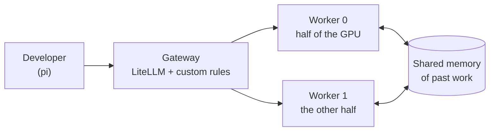
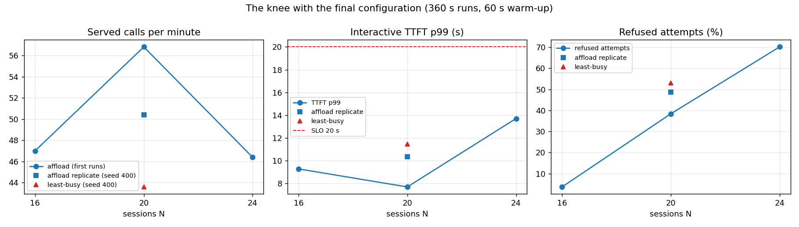
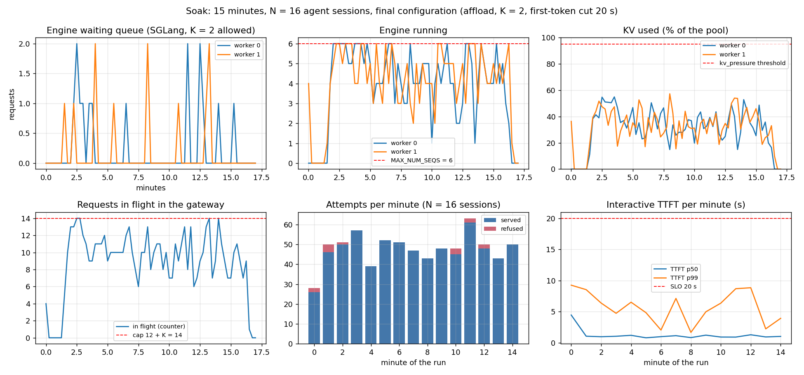
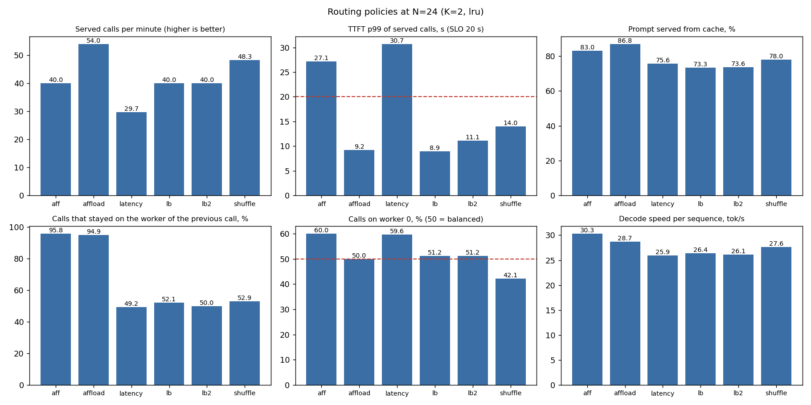
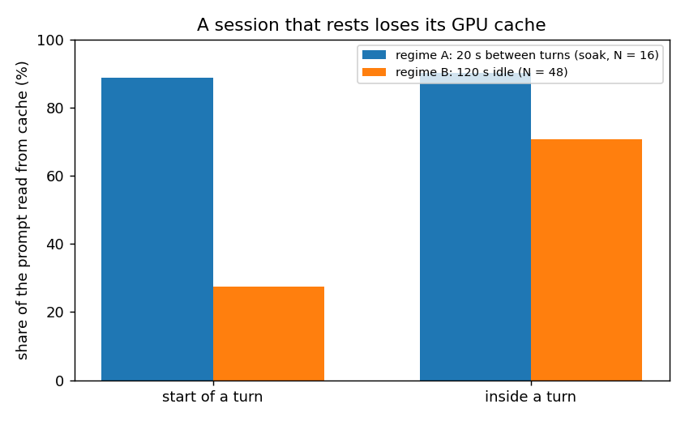
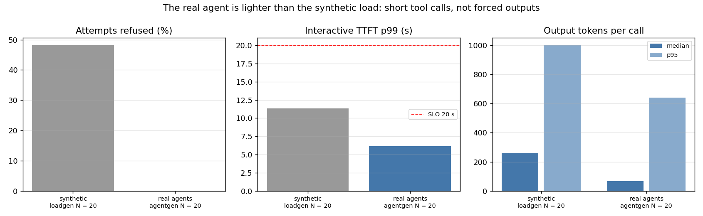
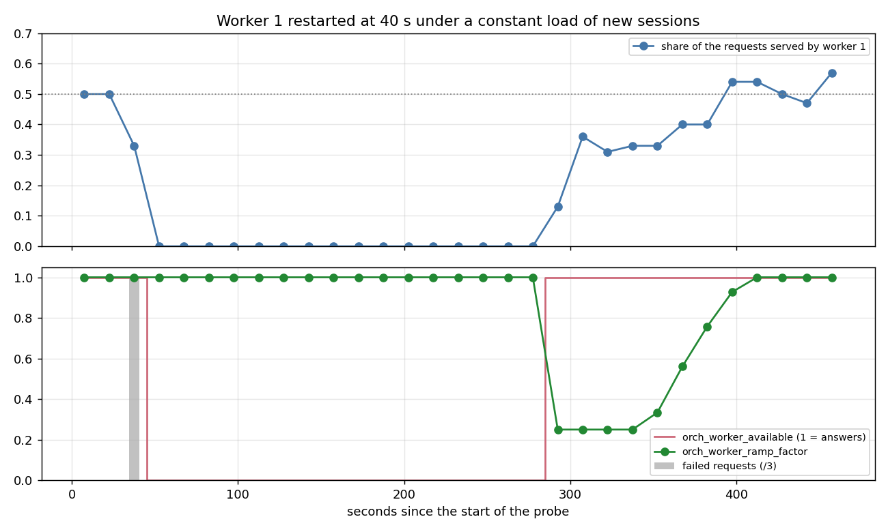

# Design: a coding assistant served from one GPU

*A short, plain-language summary of a course project (final project of the inference course: "design the cluster and serve an app"). Nothing here needs knowledge of language models. The full technical record (memory arithmetic, every decision, every scrape) is [`ARCHITECTURE.md`](ARCHITECTURE.md); the numbers below come from the runs saved in [`metrics/`](metrics/).*

## 1. Goal of the project

The goal is to **design a GPU cluster, write the control plane that decides what work gets in, and prove those decisions with measurements on a real GPU**. GPUs are scarce, so the interesting question is not "can the model answer" but "what should the system do when more people ask than the GPU can serve".

Our application is an AI coding assistant (`pi`) that reads and writes files in a project. We serve one open model, **Qwen3.5-9B**, from **one rented GPU** (an NVIDIA H100 at 3.29 USD per hour, cut into two halves), and put a small control layer in front of it. The project is an analysis: we state hypotheses, measure, and keep what the data supports, including the ideas that failed (a timer that cut slow requests, a long waiting line, an external overflow we could not test).

It answers three questions: *how many sessions can the GPU serve*, *what happens when there are too many*, and *how do we know the answers are true*.

## 2. The result in one table

| Question | Answer | Figure |
| --- | --- | --- |
| How many people at once? | About **16 coding sessions** with almost no refusals; at 20 sessions the system serves **about 50 calls a minute**. | Figure 1 |
| How fast is it? | The slowest 1 % of first words arrive in **7 to 14 s**; the target is 20 s. | Figure 1 |
| What happens when it is too busy? | The request is refused **at once** ("busy, retry"), instead of waiting a long time. Nothing is lost silently: every refusal is counted with its reason. | section 6 |
| Is it stable? | A 15-minute continuous test: 48.6 calls a minute, slowest 1 % at 7.1 s, queue never above 2, memory never above 57 %. | Figure 2 |
| What does it cost? | About **1.1 USD per 1,000 calls**, or **0.16 to 0.21 USD per active session-hour** (the GPU price divided by the work served). | section 7 |

## 3. How a request travels



The GPU is cut into two equal halves; each half runs its own copy of the model (a *worker*). Users only talk to the **gateway**, which applies three rules in order:

1. **Is it allowed?** (`security_inspect`) Right model, valid format, a sensible size. Output length is capped at 4,096 tokens so one request cannot hog a worker.
2. **Is there room?** (`admission`) Each worker can work on 6 requests at once, 12 in total. The gateway lets in **14** (12 working, 2 waiting) and answers "busy" to the 15th. Background jobs (batch) are the first to be refused so people who are typing get served.
3. **Which worker?** (`place`) A conversation stays on the same worker, because that worker already has its earlier text in memory and does not redo the work. If one worker is clearly busier, the conversation moves, and the shared memory lets the other worker pick up where it left off.

Each client (the demo, the load generators, two test tenants) has its own **key** with its own limits; a client over its limit gets "too many requests" without affecting the others.

## 4. Why we chose these settings

- **One model, no compression** ([decision 17](ARCHITECTURE.md#decision-17)). The 9B model is the strongest of its family that fits twice on one GPU half and still leaves room for long conversations. Compressing it would save memory but add quality risk we could not measure.
- **Conversations up to 64,000 tokens (about 48,000 words).** The real assistant sends calls of 21-24 thousand tokens typically and 55 thousand at most, so 64K covers all of them. Each worker can hold 6 such conversations at once (88 % of its memory), and longer would mean fewer people at once (detail in [`ARCHITECTURE.md`](ARCHITECTURE.md), *Max Concurrent Seqs*).
- **14 requests in the system, not more** ([decisions 42](ARCHITECTURE.md#decision-42) and [43](ARCHITECTURE.md#decision-43)). We tried longer waiting lines: they served no more calls and made everyone slower. Two places in the waiting line give the same throughput as none, with fewer refusals and a first word 4-8 s under the target.
- **Keep a conversation on its worker** ([decision 50](ARCHITECTURE.md#decision-50)). Compared with simply sending each call to the least busy worker, this served 16 % more calls at 20 sessions and 35 % more at 24 (Figure 3).
- **No timer that cuts slow starts** ([decisions 59](ARCHITECTURE.md#decision-59) and [61](ARCHITECTURE.md#decision-61)). We built one and removed it: the model is silent for up to a minute while it writes a long file, and the timer cut those legitimate requests. The bound on waiting comes from the small line (14), not from a timer.

## 5. What we measured

Each figure is a real run on the GPU; the raw per-call data is in `metrics/runs/`.


**Figure 1. How many sessions before it breaks.** Served calls per minute peak at 20 sessions (50-57 calls a minute) and fall at 24. Refused attempts grow from 4 % at 16 sessions to 38-49 % at 20 (two runs) and 70 % at 24: the gateway refuses the extra requests instead of slowing everyone, so the slowest 1 % of first words of the accepted ones stays between 8 and 14 s, always under the 20 s line. The two extra markers at 20 sessions compare the final placement rule with the simple "least busy worker" rule. Repeating 24 sessions on the final code gave 52.2 calls a minute with the slowest 1 % at 9.2 s.


**Figure 2. Fifteen minutes under steady load.** Throughput, waiting line (never above 2) and memory (never above 57 %) stay flat: nothing leaks and nothing drifts. A repeat of the soak on the final code gave 51.3 calls a minute, the slowest 1 % at 6.9 s and the same flat queue.


**Figure 3. Which worker should serve a call (24 sessions).** Six rules compared. Keeping a conversation on its worker unless that worker is clearly busier (`affload`) serves 54 calls a minute against 40 for picking the least busy worker (`lb`), and finds 87 % of each prompt in memory against 73 %, with the slowest 1 % of first words at 9 s in both.


**Figure 4. A resting conversation loses its shortcuts.** With short pauses (20 s) about 89 % of the prompt at the start of a turn is found in the cache. After a two-minute rest only about 27 % is: most of the history has to be read again. Plan for slower starts after idle time.


**Figure 5. Real assistants, not only synthetic load.** Sessions where the model really reads files and calls tools behave better than the synthetic load: 1 malformed call in 488, and at 20 sessions no request was refused and the slowest 1 % of first words was 6.1 s.


**Figure 6. A worker dies and comes back.** Three requests in flight failed; then nothing was sent to the dead worker. When it returned, it got only a quarter of its share at first and the rest over about two minutes, so a cold worker is not flooded.

## 6. Proof that it is live

These are lines copied from the running system (the full scrapes are in [`ARCHITECTURE.md`](ARCHITECTURE.md), *Answers with evidence*).

**The 15th request is refused instantly** (cap test, `metrics/logs/cap_probe.log`):

```text
gauge with the cap full: (200, {'litellm_admission_admitted_requests': '14.0', 'litellm_admission_queued_requests': '0.0'})
request 15: HTTP 503 in 0.01 s  (expected 503, at once)  ... "Worker at capacity: 14 in-flight, 0 queued requests. Retry later."
the 14 held requests: statuses [200]
a new request after they finished: HTTP 200 in 0.4 s  (expected 200: the place came back)
```

**Every refusal has a counted reason** (`metrics/evidence/final2/`):

```text
orch_requests_shed_total{priority_class="batch",reason="batch_pressure",status_code="503"} 397.0
litellm_admission_rejected_requests_total{reason="queue_full"} 902.0
```

**The memory of past work is reused** (183 million prompt tokens in the load runs): 57 % were found on the GPU, 20 % in host memory, 2 % in the shared pool and only **21 % had to be computed again**. A conversation that moves to the other worker found 46,904 of 46,930 tokens in the shared pool (first word in 2.3 s instead of 4.5 s cold).

**The demo works end to end:** the assistant built a working todo-list web page (`app/todo-app/`: HTML, CSS and about 300 lines of JavaScript) in about a minute and a half through this cluster (95 s in the last run); the gateway counters moved by exactly the three requests it made, all interactive.

**Workers start warm:** right after a restart the first word takes 1.76 s on a cold worker against 0.32 s warm, so the gateway waits for a warm-up before sending traffic.

Dashboards (Grafana) show all of this live: queue, memory, refusals by reason, which worker serves what, cost; four alert rules watch it (capacity shedding, memory pressure with retractions, slow first words, missing telemetry).

## 7. What it costs

The GPU costs **3.29 USD per hour whether it is busy or not** (the price comes from the course). We report cost as a measured quantity: at the steady load of the soak test (about 49 calls a minute) one thousand calls cost about **1.1 USD**, or **0.16 to 0.21 USD per active session-hour**. It is the GPU price divided by the work served, so it falls as the GPU gets busier.

**Where it is set and how it is calculated.** The cost of each request is booked in LiteLLM, in `cluster/litellm/config.yaml`, with three rates per token: 0.048 USD per million new prompt tokens, 0.009 per million prompt tokens read from the cache, and 1.59 per million output tokens. Each rate is the GPU price split between the two workers and divided by the tokens per second a worker can process of that kind. LiteLLM then keeps the spend per client key, so the same mechanism can **cap a client's budget** (`max_budget` on its key); we did not set budgets. The method, the comparison with an outside provider and how to use the budgets are in [`RUNBOOK.md`](RUNBOOK.md), *Cost and budgets*; the derivation is in [`ARCHITECTURE.md`](ARCHITECTURE.md), *Cost model*.

## 8. What can go wrong, and what happens

| Situation | What the system does |
| --- | --- |
| Too many requests | Refuses the extra ones at once with a reason; the accepted ones keep their speed. |
| A client uses more than its share | That client gets "too many requests"; others are untouched. |
| A worker crashes | Requests in flight on it fail; new ones go to the other worker; when it returns it is brought back gradually. |
| Memory of a worker nearly full | Sizing keeps it below 88 % by construction (peak measured 83 %); new long prompts would be refused first if it ever got close. |
| The model writes a very long file | Allowed to take as long as needed; no timer cuts it. |
| Background jobs flood the system | Only 10 of the 14 places are open to background jobs; the rest are kept for people. In the test with 20 % background sessions, 6.8 % of the interactive attempts were refused (goal: 10 % or less) and the slowest 1 % of first words was 9.7 s. |

## 9. Limits and what we did not do

- **Overflow to an outside model.** The gateway can decide that a refused request should go to a larger external model, and it counts what would have left, but forwarding is **off**: the external provider's account has no credits, so it could not be tested. Details in [decision 62](ARCHITECTURE.md#decision-62).
- **Automatic scaling** is not part of this design: the pool is fixed at two workers on one GPU. Adding GPUs means repeating the same pattern (the target numbers for two GPUs are in `ARCHITECTURE.md`).
- **Stale telemetry** is reported by an alert, but does not refuse requests.
- The quality of the 9B model on coding tasks was not measured by us; the choice rests on published benchmarks.

## 10. Where to read more

| You want | Go to |
| --- | --- |
| Every decision and why | [`ARCHITECTURE.md`](ARCHITECTURE.md), *Decision log* |
| How to start, use and stop it | [`RUNBOOK.md`](RUNBOOK.md) |
| The experiments and their raw data | [`notes/`](notes/), [`metrics/`](metrics/) |
| The demo (a todo app built by the assistant through this cluster) | [`app/`](app/), [`app/todo-app/`](app/todo-app/) |
| Terms used | below, or the full glossary at the end of [`ARCHITECTURE.md`](ARCHITECTURE.md) |

**Short glossary.** *Token*: a piece of a word, the unit the model reads and writes. *First word (TTFT)*: time until the first token of the answer appears. *p99*: the value that 99 % of requests beat; "the slowest 1 %". *Worker*: one copy of the model on its half of the GPU. *Cache*: stored work from earlier in a conversation, so it is not redone. *Shed*: refuse a request on purpose to protect the others. *SLO*: the target we promise (first word within 20 s for people typing).
