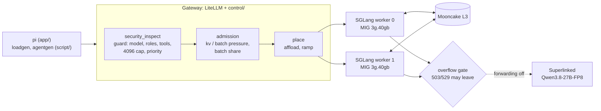

# coding-agent-inference-infra

A coding agent ([pi](https://github.com/badlogic/pi-mono)) served from **one NVIDIA H100 PCIe 80 GB** split by MIG into two
SGLang workers, behind a LiteLLM gateway whose control plane (guard, admission, placement with a session-affinity policy, fleet telemetry) is
written in this repo (four small modules), on K3s, observed with Prometheus and Grafana. Final project of the inference course
("Design the cluster and serve an app"). **Start with [`DESIGN.md`](DESIGN.md)**, a short plain-language summary with figures;
[`ARCHITECTURE.md`](ARCHITECTURE.md) is the full technical record (decisions, numbers, evidence); this file is the map.



| What | Choice |
| --- | --- |
| GPU | 1 x H100 PCIe 80 GB, MIG `3g.40gb` x 2 (one worker per instance, 39.5 GiB each) |
| Model | `Qwen/Qwen3.5-9B`, bf16 weights and bf16 KV (32 KiB/token), 64K context. No quantization anywhere |
| Engine | SGLang 0.5.21: priority scheduling, chunked prefill 4096, radix cache `lru`, HiCache GPU -> host RAM -> Mooncake L3 (`write_through`) |
| Capacity | 6 sequences of 64K per worker, 12 running; at most `12 + K` in flight with **K = 2** (LiteLLM's own admission middleware) and the next request is refused at once (503) |
| Tenants | LiteLLM virtual keys on a small PostgreSQL: one key per client or tenant with its own limits; the master key is only for administration |
| Placement | `affload`: keep a session on its worker unless it is busier by 3 requests; batch goes to the least loaded |
| SLO | interactive TTFT p99 <= 20 s, measured (7-14 s in the final runs) and bounded by K = 2; a first-token cut was tried and removed because it breaks long tool calls (decisions [59](ARCHITECTURE.md#decision-59), [61](ARCHITECTURE.md#decision-61)) |
| Overflow | 503/529 may leave to `Qwen3.8-27B-FP8` (Superlinked); 429, 500 and `slice_oom` stay. Forwarding is off (the provider's account has no credits, so it could not be tested), the gate counts what would leave |

## Repository map

| Path | Content |
| --- | --- |
| [`DESIGN.md`](DESIGN.md) | The short design for any reader: goal, result, how a request travels, why these settings, six figures, live proof, cost, limits |
| [`ARCHITECTURE.md`](ARCHITECTURE.md) | The full technical record: model choice, KV math, topology, layers, admission, status codes, hop and warm-up, alerts, 10x, risks, **decision log**, load tests, answers to the course with pasted scrapes |
| [`RUNBOOK.md`](RUNBOOK.md) | Start, check, use, update and stop the cluster; what to do when something fails |
| [`CLAUDE.md`](CLAUDE.md) | Working rules and architecture notes for the coding assistant that helped build this repo |
| [`app/`](app/) | The application (see its README): a launcher for `pi` pointed at the gateway (`app/run.sh`) and the demo (`app/demo/demo.sh`: pi builds a todo app through the cluster) |
| [`app/todo-app/`](app/todo-app/) | The folder pi writes the demo's todo list app into |
| [`control/`](control/) | The control plane, loaded by LiteLLM as callbacks: `inspect.py` (guard), `admission.py` (checks, batch share, placement call, overflow decision), `place.py` (`affload`, the ramp of a returning worker, the hop record), `fleet_state.py` (telemetry poller and metrics). The cap on requests and the tenants are LiteLLM configuration (`cluster/litellm/config.yaml`, virtual keys), not code |
| [`cluster/`](cluster/) | How everything comes up: NVIDIA plugin (MIG), PostgreSQL, SGLang workers, Mooncake, LiteLLM, Prometheus rules, Grafana dashboards |
| [`monitoring/`](monitoring/) | `build_dashboards.py`, the generator of the eight Grafana dashboards (never edit the YAML by hand) |
| [`setup/`](setup/) | `lambda_k3s.sh` (K3s), `mig.sh`, `launch_cluster.sh` (idempotent full rebuild with smoke tests and a warm-up gate), port-forwards |
| [`script/`](script/) | Load generators (`loadgen.py` synthetic, `agentgen.py` real tool-using agents), experiment runners (routing, final sweeps), `make_keys.py`, `analyze_runs.py`, `warm_workers.py`, `collect_evidence.sh` |
| [`metrics/`](metrics/) | Evidence: `runs/` (raw per-call data of every experiment), `evidence/` (scrapes, hop dictionary, eviction counts, 429/503), `probes/` (mechanism checks), `logs/` |
| [`plots/`](plots/) | Figures from the runs |
| [`notebook/`](notebook/) | `part5_queue.ipynb`: the Part 5 questions answered with the run data, and [`part5_queue.md`](notebook/part5_queue.md), the same with its results and figures as Markdown (readable without a server or Jupyter) |
| [`notes/`](notes/) | Lab notebook (`findings.md`) and the pre-registered protocols of each experiment |
| [`tests/`](tests/) | Unit tests of `control/` (standard library only) |

## Run it

```bash
# once, on the GPU machine (needs an NVIDIA GPU with MIG; on a full GPU skip setup/mig.sh)
bash setup/lambda_k3s.sh            # K3s with the NVIDIA runtime and device plugin
bash setup/mig.sh                   # 2 x 3g.40gb (not persistent across reboots)
cp .env.example .env                # LITELLM_MASTER_KEY, SUPERLINKED_API_KEY (never committed)
bash setup/launch_cluster.sh        # namespace -> PostgreSQL -> Mooncake -> workers -> smoke -> warm gate -> Prometheus/Grafana -> LiteLLM
bash setup/start_forward.sh         # grafana :3000, prometheus :9090, litellm :4000
python3 script/make_keys.py         # one LiteLLM virtual key per client (pi, loadgen, tenants), saved in .env

# the application (on your machine, through a tunnel to :4000)
app/demo/tunnel.sh up               # ssh -L for the gateway, Grafana and Prometheus
app/run.sh                          # interactive pi; see app/README.md
app/demo/demo.sh                    # DEMO: pi builds the todo app in app/todo-app/ and shows what the cluster did

# local checks, no cluster needed
python3 -m unittest discover -s tests -t .
python3 notebook/run_notebook.py    # re-executes the Part 5 notebook on the saved runs
python3 notebook/export_markdown.py # writes notebook/part5_queue.md (+ figures) from the executed notebook

# load tests (on the server)
script/sweep.sh TAG paper "16 20 24" 360        # synthetic sessions (loadgen.py)
python3 script/agentgen.py --url $URL --sessions 12 --duration 360 --out metrics/runs/TAG   # real tool-using agents
script/routing_experiment.sh TAG 20 "lb shuffle affload" 240
python3 script/analyze_runs.py --runs metrics/runs/TAG --plot plots/TAG.png
```

The edit -> sync -> test-in-the-cluster loop is described in [`CLAUDE.md`](CLAUDE.md) (`setup/sync_lambda.sh` rsyncs to the server).

## Results at a glance

All numbers are from `metrics/runs/` (raw per-call data) and explained in [`ARCHITECTURE.md`](ARCHITECTURE.md) and [`notes/findings.md`](notes/findings.md).

| Question | Answer | Where |
| --- | --- | --- |
| How many sessions before it breaks? | refusals below 5 % up to N = 16 synthetic sessions; above, the cap refuses 38-70 % of the attempts but the served ones keep TTFT p99 at 7-14 s (SLO 20 s) | `plots/final_knee.png` |
| Which worker should serve a call? | `affload` beats LiteLLM `least-busy` on every number at N = 20 with the same conversations: +16 % served, p99 10.3 s against 11.5 s, 88 % of the prompt read from cache against 74 % | `plots/routing_n24.png`, `routing_n20.png`, `final_knee.png` |
| Is it stable? | a 15-minute soak: 48.6 served/min, p99 7.1 s, queue <= 2, KV <= 57 %, nothing leaked | `plots/final_soak.png` |
| What does a resting session cost? | after 120 s of idle only 27 % of the first prompt of a turn comes from cache | `plots/final_cache_regimes.png` |
| Is priority protected? | with 20 % batch sessions interactive refusals are 6.8 % and p99 9.7 s | `plots/final_batch.png` |
| Does it hold with real agents? | yes: tool-using sessions, 1 malformed call in 488, not refused at N = 20 (the synthetic load is harder) | `plots/final_agents.png` |
| Is a replica warm when Kubernetes says ready? | no: 1.76 s cold against 0.32 s warm on a restarted worker; a worker that returns is ramped (share 0.13 -> 0.54 over ~125 s), never slammed | `metrics/probes/warm_after_restart.json`, `plots/final_ramp.png` |
| Is the KV protected? | by sizing (6 x 64K <= 88 % of the pool: peak 83 %, 0 retractions) and by `kv_pressure` for new prefixes (shown at a lowered threshold) | `metrics/logs/kv_probe_*.log` |
| What limited concurrency? | not KV (never above 62 %), but the cost of each call under load: decode per sequence falls from 49 to 15 tok/s as prefills interleave | `notes/findings.md` |

## How to start it

[`RUNBOOK.md`](RUNBOOK.md): start from a stopped machine, open the tunnel, create the keys, check, use, update, stop, and what to do when something fails.

## Where to look for each question of the course

The summary is in [`DESIGN.md`](DESIGN.md). *Where each decision lives* and the answers with pasted scrapes are in [`ARCHITECTURE.md`](ARCHITECTURE.md); the experiments behind the numbers are in
[`notes/`](notes/) and their raw data in [`metrics/runs/`](metrics/runs/).
